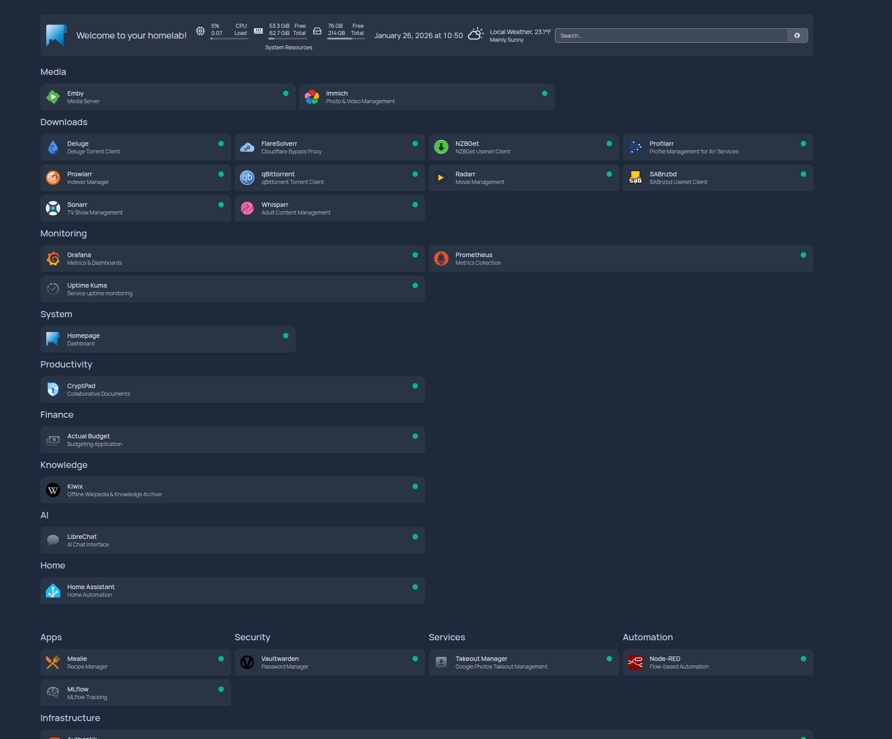
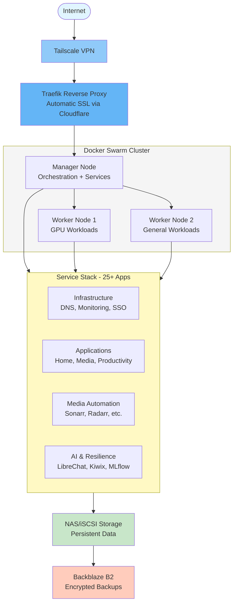
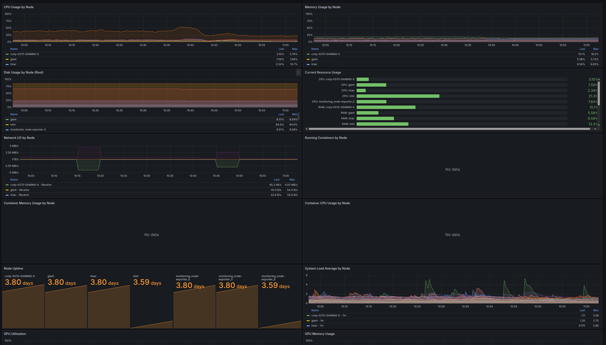
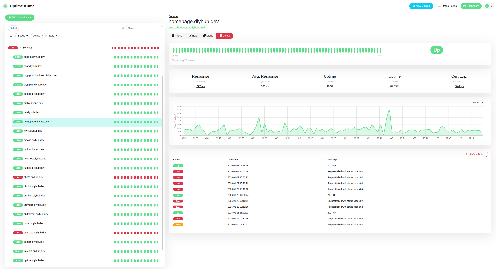

# 🏠 Homelab

**Production-Ready Self-Hosted Infrastructure • 25+ Services • One Command Deploy**


A complete Docker Swarm homelab platform with 25+ pre-configured services, automatic SSL certificates, centralized SSO, comprehensive monitoring, and automated backups. Deploy your entire self-hosted infrastructure in minutes, not weeks.

---

## 🌟 Why This Project?

Most homelab setups require weeks of configuration, trial and error, and manual service integration. **This project gives you a production-ready platform from day one** with 25+ services that just work together - complete with automated SSL, centralized authentication, full observability, and offline-first resilience features.

---

## ✨ Key Features

<div align="center">

| Feature | Description |
|---------|-------------|
| 🚀 **One-Command Deploy** | Entire infrastructure deployed with `task ansible:deploy:full` |
| 🔐 **Centralized SSO** | Authentik integrated with 8+ services for unified authentication |
| 📊 **Full Observability** | Prometheus + Grafana + Loki for metrics, dashboards, and logs |
| 🔒 **Automatic SSL** | Traefik + Cloudflare for zero-config HTTPS certificates |
| 💾 **Automated Backups** | Kopia backing up to Backblaze B2 with encryption |
| 🛡️ **Offline-First** | Wikipedia, ebooks, Stack Overflow, maps, and LLMs available offline |
| 🌐 **Remote Access** | Tailscale VPN for secure access from anywhere |
| 🧪 **Tested & CI/CD** | Comprehensive test suite with GitHub Actions automation |

</div>

---

<!-- Screenshot: Homepage Dashboard -->
<!-- Place screenshot at: /docs/images/homepage-dashboard.png -->
<!-- Recommended size: 1200x800px -->

*All your services in one place with real-time status monitoring*

---

## 📦 What's Included (25+ Services)

<details open>
<summary><b>🏗️ Infrastructure & Monitoring (11 services)</b></summary>

- **Technitium DNS** - Local DNS server with adblocking
- **Traefik** - Reverse proxy with automatic SSL
- **Prometheus + Grafana** - Metrics collection and visualization
- **Loki + Promtail** - Log aggregation and shipping
- **Node Exporter** - Host metrics collection
- **cAdvisor** - Container performance metrics
- **NVIDIA GPU Exporter** - GPU metrics and monitoring
- **Speedtest Exporter** - Network speed monitoring
- **iperf3 Server + Exporter** - Network performance testing
- **Uptime Kuma** - Uptime monitoring with notifications
- **Authentik** - Identity provider and SSO

</details>

<details>
<summary><b>🏠 Home & Productivity (6 services)</b></summary>

- **Homepage** - Unified service dashboard
- **Actual Budget** - Personal finance management
- **Home Assistant + Node-RED** - Smart home automation
- **CryptPad** - Encrypted collaborative documents
- **Mealie** - Recipe management and meal planning

</details>

<details>
<summary><b>📷 Media & Photos (3 services)</b></summary>

- **PhotoPrism** - AI-powered photo management
- **Immich** - High-performance photo backup
- **Emby** - Media server and streaming

</details>

<details>
<summary><b>🎬 Media Automation (9 services)</b></summary>

- **Sonarr** - TV series management
- **Radarr** - Movie management
- **Whisparr** - Adult content management
- **Prowlarr** - Indexer management
- **Profilarr** - Media quality profiling
- **FlareSolverr** - Cloudflare bypass for indexers
- **qBittorrent + Deluge** - Torrent clients
- **SABnzbd + NZBGet** - Usenet clients

</details>

<details>
<summary><b>🛡️ Security, AI & Resilience (4 services)</b></summary>

- **Vaultwarden** - Bitwarden-compatible password manager
- **Kiwix** - Offline Wikipedia (119GB) + Project Gutenberg + Stack Overflow
- **LibreChat** - Self-hosted AI chat interface
- **MLflow** - ML experiment tracking

</details>

<details>
<summary><b>💾 Backup & Recovery</b></summary>

- **Kopia** - Automated encrypted backups to Backblaze B2

</details>

[View complete service documentation →](https://chutch3.github.io/homelab/)

---

## 🏗️ Architecture



**Key Components:**
- **Tailscale VPN**: Secure remote access without port forwarding
- **Traefik**: Automatic SSL certificate management via Cloudflare DNS
- **Docker Swarm**: Multi-node orchestration with service placement
- **Authentik**: Single sign-on for unified authentication
- **Prometheus/Grafana**: Comprehensive monitoring and alerting
- **Kopia**: Encrypted backups to cloud storage

<!-- Screenshot: Grafana Dashboard -->

*Real-time system metrics and performance monitoring*

---

## 📋 Requirements

### Software
- **Docker** with Compose v2 (installed automatically)
- **Taskfile** for command execution ([install](https://taskfile.dev/installation/))
- **Ansible** 2.9+ (installed via `task ansible:install`)

### Services
- **Domain name** with Cloudflare DNS management
- **Cloudflare API token** for DNS-01 challenge
- **Tailscale account** for remote access (optional but recommended)

---

## 🚀 Quick Start

### 1. Clone and Configure

```bash
git clone https://github.com/chutch3/homelab.git
cd homelab

# Configure environment variables
cp .env.example .env
nano .env  # Add your domain and Cloudflare API token

# Configure host inventory
cp ansible/inventory/03-hosts.yml.example ansible/inventory/02-hosts.yml
nano ansible/inventory/02-hosts.yml  # Add your nodes
```

### 2. Deploy

```bash
# Install Ansible and dependencies
task ansible:install

# Bootstrap all nodes (installs Docker, dependencies)
task ansible:bootstrap

# Initialize Docker Swarm cluster
task ansible:cluster:init

# Deploy all services
task ansible:deploy:full
```

### 3. Access Your Services

Navigate to `https://homepage.yourdomain.com` to see your dashboard!

<!-- Screenshot: Uptime Kuma -->

*Service uptime monitoring with real-time status and notifications*

**First-time setup:**
1. Configure Authentik SSO at `https://auth.yourdomain.com`
2. Set up Grafana dashboards at `https://grafana.yourdomain.com`
3. Configure DNS records via Technitium at `https://dns.yourdomain.com`

---

## 🔧 Common Management Commands

All commands use `task` (Taskfile) for consistency:

```bash
# Deploy a single service
task ansible:deploy:stack -- -e "stack_name=sonarr"

# Check cluster status
task ansible:cluster:status

# Configure DNS records
task ansible:dns:configure

# Run tests
task test

# Check service logs
docker service logs <service-name> -f

# Teardown a service (preserve data)
task ansible:teardown:stack -- -e "stack_name=sonarr"
```

[View complete command reference →](https://chutch3.github.io/homelab/user-guide/service-management/)

---

## 📚 Documentation

**Full documentation available at: [chutch3.github.io/homelab](https://chutch3.github.io/homelab/)**

- [Getting Started Guide](https://chutch3.github.io/homelab/getting-started/quick-start/)
- [Installation Instructions](https://chutch3.github.io/homelab/getting-started/installation/)
- [Configuration Guide](https://chutch3.github.io/homelab/getting-started/configuration/)
- [Service Management](https://chutch3.github.io/homelab/user-guide/service-management/)
- [Architecture Overview](https://chutch3.github.io/homelab/architecture/overview/)
- [Storage Configuration](https://chutch3.github.io/homelab/architecture/storage/)

---

## 🗺️ Roadmap

See what's next on the journey: [View Roadmap](https://chutch3.github.io/homelab/roadmap/)

**Upcoming High-Priority Services:**
- 📄 Paperless-ngx (document management)
- ☁️ NextCloud (file sync, calendar, contacts)
- 💻 Forgejo (self-hosted git with CI/CD)
- 🤖 Ollama (local LLM for offline AI)
- 🗺️ OpenStreetMap Tile Server (offline maps)
- 📚 Kolibri (offline K-12 education)
- 💾 ArchiveBox (web page archiving)

---

## 🤝 Contributing

We welcome contributions! Here's how to get started:

1. **Write tests first** - We follow TDD methodology
2. **Use conventional commits** - Semantic versioning and automated releases
3. **Update documentation** - Keep docs in sync with changes
4. **Check CI** - Run `task check` before submitting PRs

[View contribution guidelines →](https://chutch3.github.io/homelab/)

---

## 🧪 Development

```bash
# Install development dependencies
task install

# Run full test suite
task test

# Run linting checks
task lint

# Run complete CI validation
task check

# Build documentation locally
task docs:serve
```

---

## 💡 Who Is This For?

This project is perfect if you:
- ✅ Want a **production-ready homelab** without weeks of setup
- ✅ Need **multiple services working together** with SSO
- ✅ Value **monitoring and observability** from day one
- ✅ Want **offline-first resilience** for network independence
- ✅ Appreciate **tested, documented infrastructure-as-code**
- ✅ Prefer **learning by example** from working configurations

---

## 📄 License

MIT License - see [LICENSE](LICENSE) file for details.

---

<div align="center">

**⚡ Deploy your entire homelab in minutes ⚡**

[Documentation](https://chutch3.github.io/homelab/) • [Roadmap](https://chutch3.github.io/homelab/roadmap/) • [Issues](https://github.com/chutch3/homelab/issues) • [Discussions](https://github.com/chutch3/homelab/discussions)

*Built with ❤️ for the self-hosting community*

</div>
