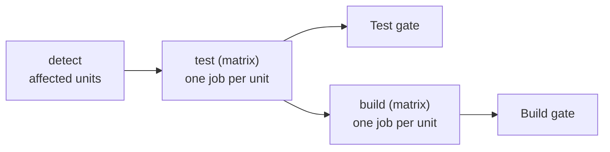

# Build & Test Pipeline

How pull requests and pushes to `main` decide what to build and test. The pipeline is change-driven: a PR only runs jobs for the apps it actually touches.

## Units

A **unit** is a Docker Compose service that declares a `build:` section — one buildable image. Units are discovered by scanning every `docker-compose.yml` under `stacks/` and `images/`; a service that pulls a stock image (e.g. `postgres`) has no `build:` section, so it is never a unit and is never built or tested here.

Each unit declares which files it cares about with an `x-homelab.watch` list, defaulting to its own stack directory:

```yaml
services:
  fiber:
    build: ...
    x-homelab:
      watch:
        - "stacks/apps/fiber/**"
```

## Change Detection

The `detect` job diffs the PR against its base and asks `ci affected` (in `tools/ci/`) which units the change touched:

- A changed file matching a unit's `watch` globs marks that unit **affected**. Matching is many-to-many, so one shared file can flag several units at once.
- A change to **build tooling** — `tools/ci/**` or `.github/workflows/build.yml` — marks **every** unit affected. These files change *how* everything is built and tested, so all apps are re-validated (see [Tooling Changes Rebuild Everything](#tooling-changes-rebuild-everything)).
- If nothing is affected, the matrix is empty and no test or build jobs run.

The result is a JSON matrix that fans out into the `test` and `build` jobs, one entry per affected image.

## Job Flow



- **`test`** — one job per affected unit; runs that unit's `unit` and `integration` suites via `ci test`. The heavier e2e tier runs separately (`e2e.yml`).
- **`build`** — one job per affected unit; builds the image. It `needs` `test`, so an image is never built when its tests fail. On a pull request the image is built but not pushed; on `main` it is pushed as `:latest` and retagged with the commit `:<sha>`.
- **`Test gate` / `Build gate`** — always-run roll-ups that fail if any matrix job failed. These are the checks branch protection requires: the matrices themselves cannot be required, because a PR that touches no units produces an empty matrix that never reports.

Images are pinned to a released version for deployment, not `:latest`. Promoting `:latest` to a version tag happens in the separate release workflow (`release.yml`).

## Tooling Changes Rebuild Everything

Because `.github/workflows/build.yml` and `tools/ci/**` are tooling globs, a PR that only changes the pipeline re-runs **every** unit's test and build. This is intentional: a broken change to the build logic should be caught against all apps before it merges, not discovered later when it silently breaks the next unrelated PR. Everyday app PRs stay narrow — only the touched app runs.
