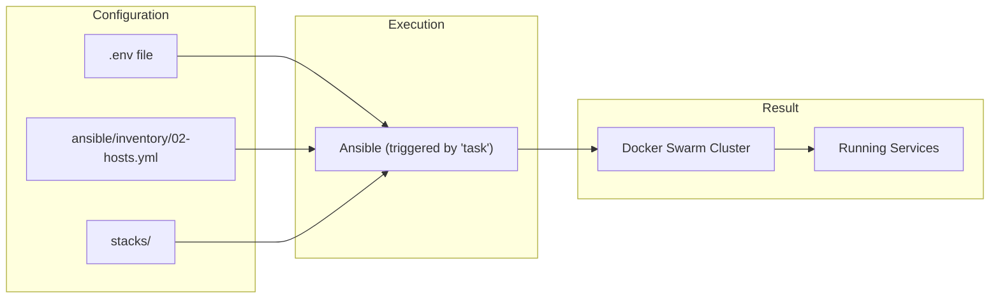

# System Architecture

A simple overview of how the homelab platform works.

## How It Works

The platform deploys Docker containers using Docker Swarm across one or more machines. The process is managed by Ansible and triggered by `task` commands.

## Key Components

### Configuration
- **`.env`** - Your domain, Cloudflare credentials, and passwords
- **`ansible/inventory/02-hosts.yml`** - List of your servers (after you create it)

### Services
- **`stacks/apps/`** - Each folder contains a Docker Compose file for one service
- **`stacks/reverse-proxy/`** - Traefik handles SSL certificates and routing
- **`stacks/dns/`** - Technitium DNS server for internal resolution

### Storage

The platform uses a **hybrid storage architecture**:

- **OCFS2 (cluster filesystem on iSCSI)** - For application databases and configuration
- **CIFS/SMB network shares** - For large media files
- **Local Docker volumes** - For temporary and cache data

**Important:** SQLite databases (used by Sonarr, Radarr, Prowlarr, etc.) **must** use OCFS2 storage, not CIFS, to prevent database corruption.

See [Storage Architecture](storage.md) for detailed information about:
- How iSCSI + OCFS2 works
- Volume configuration patterns
- Why different storage types for different use cases
- Performance considerations and troubleshooting

## Deployment Process

When you run `task ansible:deploy:full`:

1. Sets up Docker Swarm cluster across your machines
2. Deploys infrastructure (DNS, Traefik proxy, monitoring)
3. Deploys all application services in parallel
4. Traefik automatically gets SSL certificates from Let's Encrypt

## Adding Services

To add a new service:

1. Create `stacks/apps/myservice/docker-compose.yml`
2. Include Traefik labels for routing
3. Run `task ansible:deploy:stack -- -e "stack_name=myservice"` to deploy it

## Removing Services

To remove a service:

1. Delete the `stacks/apps/servicename/` folder
2. Run `task ansible:teardown:stack -- -e "stack_name=servicename"` to clean up data

That's it! The system handles the rest automatically.
