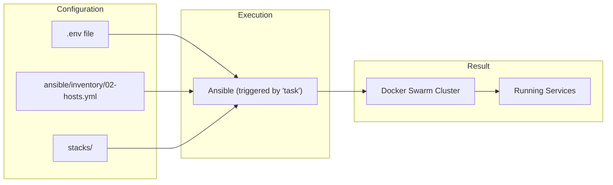

# System Architecture

A simple overview of how the homelab platform works.

## How It Works

The platform deploys Docker containers using Docker Swarm across one or more machines. The process is managed by Ansible and triggered by `task` commands.

```mermaid
graph LR
    subgraph Configuration
        A[".env file"]
        B["ansible/inventory/02-hosts.yml"]
        C["stacks/"]
    end
    subgraph Execution
        D["Ansible (triggered by 'task')"]
    end
    subgraph Result
        E["Docker Swarm Cluster"]
        F["Running Services"]
    end

    A --> D
    B --> D
    C --> D
    D --> E
    E --> F
```

## Design Principles

1.  **Infrastructure as Code (IaC)**: The entire state of the homelab (hosts, services, configuration) is defined in version-controlled text files.
2.  **Simplicity over Complexity**: Docker Swarm and standard Docker Compose files are used for their simplicity and low learning curve compared to more complex orchestrators like Kubernetes.
3.  **Extensibility**: Adding a new service is as simple as creating a new subdirectory in `stacks/` with a `docker-compose.yml` file. No central registration is needed.
4.  **Separation of Concerns**:
    - `.env`: Holds secrets and instance-specific configuration.
    - `inventory/`: Defines the machine infrastructure.
    - `stacks/`: Defines the services to be run.
    - `playbooks/`: Defines the deployment logic.

---

## Deployment Process

When you run `task ansible:deploy`:

1.  **Bootstrap Nodes**: Prepares all nodes with Docker, dependencies, and security.
2.  **Swarm Setup**: Sets up Docker Swarm cluster across your machines.
3.  **Networking**: Creates a shared overlay network (`traefik-public`) for service discovery and routing.
4.  **Core Stacks**: Deploys infrastructure (DNS, Traefik proxy, monitoring).
5.  **Applications**: Deploys all application services in parallel.
6.  **SSL/DNS**: Traefik automatically gets SSL certificates from Let's Encrypt and Technitium registers service domains.

---

## Key Components

### 1. Reverse Proxy (Traefik)
Traefik handles SSL termination and routing. It automatically detects services on the `traefik-public` network via Docker labels.

### 2. DNS (Technitium)
Technitium is the **primary DNS** server, providing local DNS resolution for the cluster. It automatically registers A records for nodes and CNAME records for services.

An optional **secondary DNS** (Pi-hole v6) can be kept in sync. When `SECONDARY_DNS_ENABLED=true`, every DNS registration operation (add or remove) is mirrored to Pi-hole via its REST API. Your router handles failover — if Technitium goes down, clients switch to Pi-hole and services remain accessible.

See [Secondary DNS and Pi-hole Sync](../troubleshooting.md#secondary-dns-and-pi-hole-sync) for Pi-hole requirements and configuration.

### 3. Storage Architecture
The platform uses a **hybrid storage architecture**:

- **OCFS2 (cluster filesystem on iSCSI)** - For application databases and configuration.
- **CIFS/SMB network shares** - For large media files.
- **Local Docker volumes** - For temporary and cache data.

**Important:** SQLite databases (used by Sonarr, Radarr, Prowlarr, etc.) **must** use OCFS2 storage, not CIFS, to prevent database corruption.

See [Storage Architecture](storage.md) for detailed information.

## Adding Services

To add a new service:

1. Create `stacks/apps/myservice/docker-compose.yml`
2. Include Traefik labels for routing
3. Run `task ansible:deploy:stack -- -e "stack_name=myservice"` to deploy it

## Removing Services

To remove a service:

1. Delete the `stacks/apps/servicename/` folder
2. Run `task ansible:teardown:stack -- -e "stack_name=servicename"` to clean up data

That's it! The system handles the rest automatically.
