# Storage Architecture

This document explains the storage architecture used in the homelab platform, including iSCSI, OCFS2 cluster filesystem, and CIFS network shares.

## Overview

The platform uses a **hybrid storage architecture** combining three storage technologies:

1. **iSCSI + OCFS2** - Cluster filesystem for application databases and configuration
2. **CIFS/SMB** - Network shares for large media files
3. **Local Docker Volumes** - For services that don't need shared storage

```mermaid
graph TB
    subgraph "Storage Architecture"
        subgraph "iSCSI Block Storage"
            ISCSI[iSCSI Target on NAS<br/>Block-level storage device]
        end

        subgraph "Cluster Filesystem Layer"
            OCFS2[OCFS2 Filesystem<br/>Mounted at /mnt/iscsi/media-apps/<br/>Cluster-safe, concurrent access]
        end

        subgraph "Network File Storage"
            CIFS[CIFS/SMB Shares<br/>//nas/torrents<br/>//nas/usenet]
        end

        subgraph "Docker Swarm Nodes"
            NODE1[Manager Node<br/>node-1]
            NODE2[Worker Node<br/>node-2]
            NODE3[Worker Node<br/>node-3]
            NODE4[Worker Node<br/>node-4]
        end

        subgraph "Docker Volumes"
            BIND[Bind Mounts<br/>type: none, o: bind<br/>→ /mnt/iscsi/media-apps/service]
            CIFSV[CIFS Mounts<br/>type: cifs<br/>→ //nas/share]
        end

        ISCSI --> OCFS2
        OCFS2 --> NODE1
        OCFS2 --> NODE2
        OCFS2 --> NODE3
        OCFS2 --> NODE4

        CIFS --> NODE1
        CIFS --> NODE2
        CIFS --> NODE3
        CIFS --> NODE4

        NODE1 --> BIND
        NODE1 --> CIFSV
        NODE2 --> BIND
        NODE2 --> CIFSV
        NODE3 --> BIND
        NODE3 --> CIFSV
        NODE4 --> BIND
        NODE4 --> CIFSV
    end
```



## Why This Architecture?

### Problem: SQLite + Network Filesystems = Corruption

Many self-hosted applications (Sonarr, Radarr, Prowlarr, etc.) use **SQLite databases** for configuration and metadata. SQLite requires:

- **POSIX-compliant filesystem**: Proper file locking and atomic operations
- **Exclusive access**: File locks must work correctly across processes
- **No network latency**: Consistent I/O for database integrity

**CIFS/SMB network shares DO NOT provide these guarantees** and will cause SQLite database corruption when accessed from multiple nodes or even from a single node under load.

### Solution: OCFS2 Cluster Filesystem on iSCSI

**OCFS2 (Oracle Cluster File System 2)** is a cluster-aware filesystem that provides:

- ✅ **True POSIX compliance**: Proper file locking, atomic operations
- ✅ **Cluster-safe**: Multiple nodes can mount simultaneously with distributed lock manager
- ✅ **Block-level storage**: Runs on iSCSI, providing local-disk performance
- ✅ **SQLite compatible**: Safe for database files

## Storage Architecture Components

### 1. iSCSI Block Storage

**iSCSI (Internet Small Computer Systems Interface)** provides block-level storage over the network.

**Key Characteristics:**
- Block-level storage device (like a virtual hard drive)
- Presented to nodes as `/dev/sda`, `/dev/sdb`, etc.
- Low-level I/O, suitable for filesystems
- Hosted on NAS (e.g., OpenMediaVault, TrueNAS)

**In this setup:**
- iSCSI target hosted on NAS (e.g., `192.168.1.100`)
- Mounted as block device on all Docker Swarm nodes
- OCFS2 filesystem created on the iSCSI device

### 2. OCFS2 Cluster Filesystem

**OCFS2** is a shared-disk cluster filesystem developed by Oracle.

**Key Features:**
- **Concurrent mounting**: All nodes can mount `/mnt/iscsi/media-apps/` simultaneously
- **Distributed locking**: O2CB (OCFS2 Cluster Base) coordinates locks across nodes
- **Heartbeat mechanism**: `heartbeat=local` for single iSCSI device setups
- **Full POSIX semantics**: Safe for SQLite and other databases

**Cluster Configuration:**
```bash
# O2CB cluster stack with local heartbeat
mount -t ocfs2 /dev/sda /mnt/iscsi/media-apps/
# Options: heartbeat=local,nointr,data=ordered,coherency=full
```

**Mount on all nodes:**
```bash
# Each node mounts the same OCFS2 filesystem
node-1: /dev/sda → /mnt/iscsi/media-apps/
node-2: /dev/sdb → /mnt/iscsi/media-apps/
node-3: /dev/sda → /mnt/iscsi/media-apps/
node-4: /dev/sdb → /mnt/iscsi/media-apps/
```

### 3. CIFS/SMB Network Shares

**CIFS (Common Internet File System)** provides network file sharing.

**Use Cases:**
- ✅ Large media files (movies, TV shows, downloads)
- ✅ Read-heavy workloads with minimal writes
- ✅ Shared media libraries accessed by multiple services
- ❌ **NOT for SQLite databases** (causes corruption)

**Mounted via Docker volumes:**
```yaml
volumes:
  torrents:
    driver: local
    driver_opts:
      type: "cifs"
      o: "username=${SMB_USERNAME},password=${SMB_PASSWORD},vers=3.0,..."
      device: "//${NAS_SERVER}/torrents"
```

## Docker Volume Configuration Patterns

### Pattern 1: OCFS2 Bind Mount (for SQLite databases)

Used for application configuration and databases that require POSIX filesystem.

**Example: Sonarr, Radarr, Prowlarr, Whisparr**

```yaml
volumes:
  sonarr_config:
    driver: local
    driver_opts:
      type: "none"              # Bind mount (not a filesystem type)
      o: "bind"                  # Bind mount operation
      device: "/mnt/iscsi/media-apps/sonarr"  # OCFS2 mount point
```

**How it works:**
1. OCFS2 filesystem mounted at `/mnt/iscsi/media-apps/` on all nodes
2. Service-specific subdirectory created (e.g., `sonarr/`, `radarr/`)
3. Docker bind-mounts the subdirectory into the container
4. Container sees `/config` → backed by OCFS2 cluster filesystem
5. SQLite database operations are safe and atomic

**Directory structure on OCFS2:**
```
/mnt/iscsi/media-apps/
├── sonarr/
│   ├── config.xml
│   ├── sonarr.db          ← SQLite database (SAFE on OCFS2)
│   └── logs/
├── radarr/
│   ├── config.xml
│   ├── radarr.db          ← SQLite database (SAFE on OCFS2)
│   └── logs/
├── prowlarr/
└── whisparr/
```

### Pattern 2: CIFS Mount (for media files)

Used for large files that don't require database-level integrity.

**Example: Torrents, Usenet, Media Libraries**

```yaml
volumes:
  torrents:
    driver: local
    driver_opts:
      type: "cifs"
      o: "username=${SMB_USERNAME},password=${SMB_PASSWORD},domain=${SMB_DOMAIN},vers=3.0,file_mode=0770,dir_mode=0770,uid=1000,gid=1000,soft,actimeo=30"
      device: "//${NAS_SERVER}/torrents"
```

**How it works:**
1. Docker mounts CIFS share from NAS
2. Container sees `/data/torrents` → backed by CIFS network share
3. Used for read/write of large media files
4. **NOT used for SQLite databases**

### Pattern 3: Hybrid Configuration

Most media management services use **both** OCFS2 and CIFS volumes.

**Complete example: Radarr (movie management)**

```yaml
version: "3.9"

services:
  radarr:
    image: lscr.io/linuxserver/radarr:latest
    environment:
      - PUID=1000
      - PGID=1000
      - TZ=${TZ}
    volumes:
      - radarr_config:/config        # OCFS2 for SQLite database
      - torrents:/data/torrents      # CIFS for media files
      - usenet:/data/usenet          # CIFS for media files

volumes:
  # OCFS2 bind mount for configuration/database
  radarr_config:
    driver: local
    driver_opts:
      type: "none"
      o: "bind"
      device: "/mnt/iscsi/media-apps/radarr"

  # CIFS mounts for media files
  torrents:
    driver: local
    driver_opts:
      type: "cifs"
      o: "username=${SMB_USERNAME},password=${SMB_PASSWORD},vers=3.0,..."
      device: "//${NAS_SERVER}/torrents"

  usenet:
    driver: local
    driver_opts:
      type: "cifs"
      o: "username=${SMB_USERNAME},password=${SMB_PASSWORD},vers=3.0,..."
      device: "//${NAS_SERVER}/usenet"
```

**Why hybrid?**
- ✅ Database on OCFS2: Fast, reliable, cluster-safe
- ✅ Media on CIFS: Large storage capacity, shared across services
- ✅ Best of both worlds: Performance + capacity

## Service Deployment Behavior

### Initial Deployment: CIFS Mount Delay

When deploying a service with CIFS volumes, Docker Swarm enters a **"Preparing" phase** that can take **10-15 minutes**.

**What's happening during "Preparing":**
1. Docker pulls the container image (if not cached)
2. Docker creates the OCFS2 bind mount (fast, ~1 second)
3. **Docker mounts CIFS volumes (slow, 5-10 minutes per volume)**:
   - Network connection to NAS
   - CIFS protocol negotiation (SMB3)
   - Authentication (username/password/domain)
   - Mount option setup (file_mode, dir_mode, uid/gid)
   - Retry logic with `soft` mount option
4. Container starts once all volumes are ready

**Example timeline:**
```
00:00 - Service deployed: docker stack deploy radarr
00:01 - Task created, image pulled
00:02 - State: "Preparing" (mounting volumes)
00:03 - OCFS2 bind mount: ✅ Complete (fast)
00:04 - CIFS torrents mount: ⏳ Connecting...
00:08 - CIFS torrents mount: ⏳ Authenticating...
00:10 - CIFS torrents mount: ✅ Complete
00:11 - CIFS usenet mount: ⏳ Connecting...
00:15 - CIFS usenet mount: ✅ Complete
00:16 - State: "Running" 🎉
```

**This is normal behavior** and only happens on:
- Initial deployment
- Node failure/recovery
- Service redeployment with volume cleanup

**Once mounted, CIFS volumes persist** and subsequent container restarts are fast (~5 seconds).

## Storage Decision Matrix

| Use Case | Storage Type | Why |
|----------|--------------|-----|
| SQLite databases | OCFS2 (iSCSI) | POSIX compliance, file locking, no corruption |
| Application config files | OCFS2 (iSCSI) | Cluster-safe, fast access |
| Small persistent data | OCFS2 (iSCSI) | Low latency, reliable |
| Large media libraries | CIFS/SMB | High capacity, shared access |
| Download directories | CIFS/SMB | Large files, shared across services |
| Read-heavy media | CIFS/SMB | Optimized for streaming |
| Temporary files | Local Docker Volume | Fast, no network overhead |
| Cache directories | Local Docker Volume | High I/O, disposable data |

## Best Practices

### ✅ DO:

- **Use OCFS2 for SQLite databases** (Sonarr, Radarr, Prowlarr, etc.)
- **Use CIFS for large media files** (movies, TV shows, downloads)
- **Set correct permissions** on OCFS2 directories (`chown 1000:1000`, `chmod 770`)
- **Monitor OCFS2 cluster health** (`o2cb` service, heartbeat status)
- **Allow time for CIFS mounts** during initial deployment (10-15 minutes)

### ❌ DON'T:

- **Never use CIFS for SQLite databases** (will corrupt)
- **Don't mix storage types** for the same data (consistency issues)
- **Don't assume instant mounts** for CIFS volumes
- **Don't skip backup** before storage migrations

## Troubleshooting

### Service stuck in "Preparing" state

**Cause:** CIFS volume mounting in progress

**Solution:** Wait 10-15 minutes for CIFS mounts to complete

**Verify:**
```bash
# Check mount status on the node
ssh user@node "mount | grep cifs"

# Check Docker volume status
docker volume inspect <stack>_<volume>
```

### SQLite database corruption

**Cause:** Using CIFS/SMB for SQLite database

**Solution:** Migrate to OCFS2 bind mount

**Steps:**
1. Stop the service
2. Backup data from CIFS share
3. Create OCFS2 directory: `mkdir -p /mnt/iscsi/media-apps/service`
4. Update docker-compose.yml to use OCFS2 bind mount
5. Restore data to OCFS2 location
6. Redeploy service

### OCFS2 mount missing

**Cause:** iSCSI device not connected or OCFS2 not mounted

**Solution:**
```bash
# Check iSCSI connection
sudo iscsiadm -m session

# Check OCFS2 mount
mount | grep ocfs2

# Remount if needed
sudo mount -t ocfs2 /dev/sda /mnt/iscsi/media-apps/
```

## Performance Considerations

### OCFS2 Performance

- **Latency:** Similar to local disk (iSCSI overhead ~1-2ms)
- **Throughput:** Limited by network (1Gbps = ~120 MB/s, 10Gbps = ~1200 MB/s)
- **Concurrency:** Excellent (designed for multi-node access)
- **Best for:** Small files, databases, config files

### CIFS Performance

- **Latency:** Higher than OCFS2 (~5-20ms)
- **Throughput:** Good for large files (100+ MB/s on Gigabit)
- **Concurrency:** Good for read-heavy workloads
- **Best for:** Large media files, streaming

### Optimization Tips

1. **Use 10GbE networking** for iSCSI if possible (10x faster)
2. **Enable jumbo frames** (MTU 9000) for iSCSI traffic
3. **Use CIFS multichannel** (SMB 3.x) for better throughput
4. **Set appropriate cache timeouts** (`actimeo=30` for CIFS)
5. **Use `soft` mount option** for CIFS to prevent hangs

## Migration Example

### Before: CIFS-based Prowlarr (BROKEN)

```yaml
volumes:
  prowlarr:
    driver: local
    driver_opts:
      type: "cifs"
      o: "username=${SMB_USERNAME},password=${SMB_PASSWORD},vers=3.0"
      device: "//${NAS_SERVER}/prowlarr"
```

**Problem:** SQLite database corruption on CIFS

### After: OCFS2-based Prowlarr (WORKING)

```yaml
volumes:
  prowlarr_config:
    driver: local
    driver_opts:
      type: "none"
      o: "bind"
      device: "/mnt/iscsi/media-apps/prowlarr"
```

**Solution:** SQLite database on OCFS2 cluster filesystem

## Summary

The hybrid storage architecture provides:

- ✅ **Cluster-safe databases** via OCFS2 on iSCSI
- ✅ **Large media storage** via CIFS network shares
- ✅ **Flexible deployment** across any Docker Swarm node
- ✅ **No single point of failure** (except NAS itself)
- ✅ **Optimal performance** for each workload type

This architecture ensures **data integrity**, **high availability**, and **performance** for self-hosted applications in a multi-node Docker Swarm cluster.
