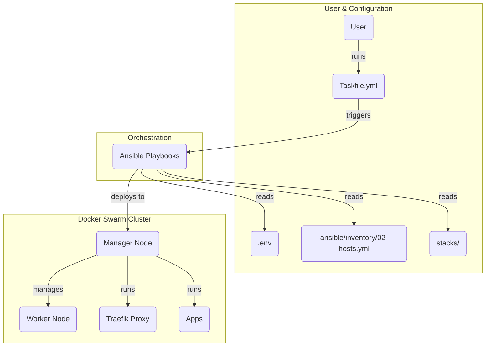

# 🏠 Selfhosted

**Unified • Automated • Production-Ready**

- :material-rocket-launch: **[Quick Start](getting-started/quick-start.md)**

    ---

    Get up and running in minutes with our step-by-step guide

- :material-cog: **[Service Management](user-guide/service-management.md)**

    ---

    Learn how to manage and configure your self-hosted services

- :material-sitemap: **[Architecture](architecture/overview.md)**

    ---

    Understand the unified system architecture

- :material-road: **[Roadmap](roadmap.md)**

    ---

    See what's coming next in our development roadmap

## What is Selfhosted?

A Docker Swarm-based homelab platform that simplifies running multiple self-hosted services. With pre-configured compose files for **28+ popular services**, automatic SSL certificates via Traefik, centralized SSO via Authentik, and automated backups, you can have a complete production-ready homelab infrastructure running in minutes.

!!! tip "What is self-hosting?"
    Self-hosting is the practice of running and maintaining your own services instead of relying on third-party providers, giving you control over your data and infrastructure.

---

## ✨ Key Features

- :package: **28+ Pre-Configured Services**

    ---

    Ready-to-deploy stacks for media, finance, AI, and more.
    **[Browse the Catalog →](services/index.md)**

- :shield: **Automatic SSL & Proxy**

    ---

    Traefik reverse proxy with Let's Encrypt + Cloudflare DNS automation.

- :material-account-key: **Centralized SSO**

    ---

    Identity management and single sign-on via Authentik integrated with 10+ apps.

- :material-harddisk: **Hybrid Storage**

    ---

    iSCSI for databases and CIFS/SMB for media, ensuring performance and stability.

- :material-test-tube: **Production Ready**

    ---

    Docker Swarm orchestration with health checks and rolling updates.

- :material-rocket-launch: **One-Command Deploy**

    ---

    Deploy your entire stack with `task ansible:deploy` after a simple setup.

---

## 🏗️ Architecture Overview

```mermaid
graph TB
    subgraph "User & Configuration"
        USER("User")
        TASK("Taskfile.yml")
        DOT_ENV(".env")
        INVENTORY("ansible/inventory/02-hosts.yml")
        STACKS_DIR("stacks/")
    end

    subgraph "Orchestration"
        ANSIBLE("Ansible Playbooks")
    end

    subgraph "Docker Swarm Cluster"
        MANAGER("Manager Node")
        WORKER("Worker Node")
        TRAEFIK("Traefik Proxy")
        APPS("Apps")
    end

    USER -- "runs" --> TASK
    TASK -- "triggers" --> ANSIBLE
    ANSIBLE -- "reads" --> DOT_ENV
    ANSIBLE -- "reads" --> INVENTORY
    ANSIBLE -- "reads" --> STACKS_DIR
    ANSIBLE -- "deploys to" --> MANAGER
    MANAGER -- "manages" --> WORKER
    MANAGER -- "runs" --> TRAEFIK
    MANAGER -- "runs" --> APPS
```

---

## 🚀 Getting Started

Ready to start your self-hosting journey? Choose your path:

- :material-timer-fast: **[Quick Start →](getting-started/quick-start.md)**

    ---

    Get up and running on a single machine in 5 minutes.

- :material-book-open-page-variant: **[Full Installation Guide →](getting-started/installation.md)**

    ---

    Complete multi-node setup with network storage and SSO.

- :material-view-list: **[Services Catalog →](services/index.md)**

    ---

    Explore all 28+ pre-configured application stacks.

## 🏷️ Tags

[Browse by tags](tags.md) to find content relevant to your use case.
