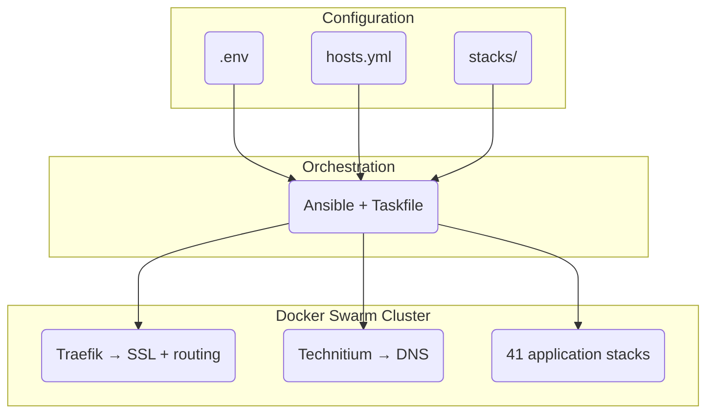

# Homelab

A Docker Swarm platform for self-hosting 40+ services with automatic SSL, SSO, and one-command deployment.

---

## Get Started

Watch the full deployment play out in a terminal session — from prerequisites check to 41 running services:

**[Launch Quick Start →](getting-started/quick-start.md)**

---

## What You Get

- **41 services** — media, AI, finance, monitoring, dev tools, education, privacy
- **Automatic SSL** — Traefik + Let's Encrypt via Cloudflare DNS
- **Single sign-on** — Authentik integrated with 15 services
- **Hybrid storage** — OCFS2 for databases, CIFS for media
- **One command** — `task ansible:deploy`

---

## Architecture

```mermaid
graph TB
    subgraph "Configuration"
        ENV(".env")
        HOSTS("hosts.yml")
        STACKS("stacks/")
    end

    subgraph "Orchestration"
        ANSIBLE("Ansible + Taskfile")
    end

    subgraph "Docker Swarm Cluster"
        TRAEFIK("Traefik → SSL + routing")
        DNS("Technitium → DNS")
        APPS("41 application stacks")
    end

    ENV --> ANSIBLE
    HOSTS --> ANSIBLE
    STACKS --> ANSIBLE
    ANSIBLE --> TRAEFIK
    ANSIBLE --> DNS
    ANSIBLE --> APPS
```

---

## Navigate

- [Services Catalog](services/index.md) — all 41 stacks
- [Configuration](getting-started/configuration.md) — env vars, secrets, host inventory
- [Service Management](user-guide/service-management.md) — deploy, filter, remove
- [Shutdown & Startup](user-guide/shutdown-startup.md) — safe power procedures
- [Tailscale VPN](user-guide/tailscale.md) — remote access without port forwarding
- [Storage Architecture](architecture/storage.md) — OCFS2, iSCSI, CIFS
- [Roadmap](roadmap.md) — what's coming next
