# 🏠 Selfhosted

**Unified • Automated • Production-Ready**

<div class="grid cards" markdown>

- :material-rocket-launch: **[Quick Start](getting-started/quick-start.md)**

    ---

    Get up and running in minutes with our step-by-step guide

- :material-cog: **[Service Management](user-guide/service-management.md)**

    ---

    Learn how to manage and configure your self-hosted services

- :material-sitemap: **[Architecture](architecture/overview.md)**

    ---

    Understand the unified system architecture

- :material-road: **[Roadmap](roadmap.md)**

    ---

    See what's coming next in our development roadmap

</div>

## What is Selfhosted?

A Docker Swarm-based homelab deployment platform that simplifies running multiple self-hosted services. With pre-configured compose files for 12+ popular services, automatic SSL certificates via Traefik, and network storage integration, you can have a complete homelab infrastructure running in minutes.

!!! tip "What is self-hosting?"
    Self-hosting is the practice of running and maintaining your own services instead of relying on third-party providers, giving you control over your data and infrastructure. For more information, see [r/selfhosted](https://www.reddit.com/r/selfhosted/wiki/index).

## 🚀 Why This Homelab Platform?

<div class="grid cards" markdown>

- :package: **Pre-Configured Services**

    ---

    12+ ready-to-deploy services with Docker Compose files

- :shield: **Automatic SSL**

    ---

    Traefik reverse proxy with Let's Encrypt + Cloudflare DNS

- :network-wired: **Network Storage**

    ---

    Built-in SMB/CIFS support for persistent data on NAS

- :material-kubernetes: **Docker Swarm Ready**

    ---

    Multi-node orchestration and high availability

- :material-test-tube: **Battle-Tested**

    ---

    Comprehensive linting, static analysis, and validation playbooks

- :material-rocket-launch-outline: **One-Command Deploy**

    ---

    Deploy everything with `task ansible:deploy:full` after a one-time setup.

</div>

## ✨ Key Features

### :material-file-code: Environment-Based Configuration
Single `.env` file contains all configuration - domains, credentials, storage paths, and API keys.

### :material-package: Pre-Built Service Stack
12+ popular services with production-ready Docker Compose configurations including Traefik labels.

### :material-console: Simple Deployment Interface
A simple `Taskfile.yml` provides a clean and consistent interface for all management commands, powered by Ansible.

### :material-certificate: SSL Certificate Automation
Traefik reverse proxy with Let's Encrypt certificates via Cloudflare DNS challenge - fully automated.

### :material-dns: Reverse Proxy Integration
Every service pre-configured with Traefik labels for automatic routing and SSL termination.

### :material-kubernetes: Docker Swarm Orchestration
Multi-node deployment with automatic service placement, health checks, and rolling updates.

## 📋 Available Services

Pre-configured Docker Compose stacks ready for deployment:

=== "📊 Finance & Budgeting"

    - **[Actual Budget](https://actualbudget.org/)** - Personal finance and budgeting application

=== "📸 Media & Entertainment"

    - **[PhotoPrism](https://photoprism.app/)** - AI-powered photo management and organization
    - **[Emby](https://emby.media/)** - Media server for streaming movies and TV shows

=== "🏠 Smart Home & Automation"

    - **[Home Assistant](https://www.home-assistant.io/)** - Open source home automation platform

=== "📝 Collaboration & Productivity"

    - **[CryptPad](https://cryptpad.fr/)** - Encrypted collaborative document editing
    - **[LibreChat](https://librechat.ai/)** - AI chat interface supporting multiple LLM providers

=== "🌐 Core Infrastructure"

    - **[Homepage](https://gethomepage.dev/)** - Centralized dashboard for all services
    - **[Traefik](https://traefik.io/)** - Reverse proxy with automatic SSL certificates
    - **[Technitium DNS](https://technitium.com/dns/)** - Local DNS server for internal service resolution

=== "🎬 Media Automation"

    - **[Sonarr](https://sonarr.tv/)** - TV series management and automation
    - **[Radarr](https://radarr.video/)** - Movie management and automation
    - **[Prowlarr](https://prowlarr.com/)** - Indexer manager for media automation
    - **Downloads Stack** - Unified qBittorrent, Deluge, and VPN setup with SOCKS5 proxy

**Total: 13 pre-configured services** with more being added regularly!

## 🎯 Quick Example

Deploy your entire homelab with just a few commands:

```bash
# 1. Clone and setup
git clone https://github.com/yourusername/homelab.git
cd homelab

# 2. Configure your environment
cp .env.example .env
nano .env  # Set your domain, Cloudflare credentials, etc.

# 3. Configure your hosts
cp ansible/inventory/03-hosts.yml.example ansible/inventory/02-hosts.yml
nano ansible/inventory/02-hosts.yml # Add your hosts and their roles

# 4. Install Ansible and dependencies
task ansible:install

# 5. Deploy everything
task ansible:bootstrap
task ansible:cluster:init
task ansible:deploy:full
```

**That's it!** All services deploy automatically with:
- ✅ Automatic SSL certificates via Let's Encrypt + Cloudflare
- ✅ Traefik reverse proxy routing
- ✅ SMB/CIFS network storage integration
- ✅ Docker Swarm orchestration across multiple nodes
- ✅ Homepage dashboard showing all services

Or deploy specific services only:
```bash
# Deploy only essential services
task ansible:deploy -- -e "only_apps=homepage,actual"

# Deploy everything except heavy media services
task ansible:deploy -- -e "skip_apps=photoprism,emby"
```

## 🏗️ Architecture Overview

```mermaid
graph TB
    subgraph "🎯 Docker Swarm Homelab Platform"
        ENV["📄 .env<br/>🔑 Configuration & Credentials"]
        INVENTORY["⚙️ ansible/inventory/<br/>🏠 Multi-Node Setup"]
        STACKS["📦 stacks/<br/>📁 Service Compose Files"]

        subgraph "🏗️ Infrastructure Stack"
            DNS["🌐 Technitium DNS<br/>Internal Resolution"]
            TRAEFIK["🚪 Traefik Proxy<br/>SSL + Routing"]
            MONITORING["📊 Prometheus/Grafana<br/>System Monitoring"]
        end

        subgraph "📱 Application Services"
            APPS["🏠 Homepage Dashboard<br/>💰 Actual Budget<br/>🎬 Media Services<br/>🏡 Home Assistant<br/>📝 Collaboration Tools"]
        end

        subgraph "💾 Storage Layer"
            CIFS["🗂️ SMB/CIFS Volumes<br/>Network Storage"]
            LOCAL["💽 Local Docker Volumes<br/>Node Storage"]
        end
    end

    ENV --> STACKS
    INVENTORY --> STACKS
    STACKS --> DNS
    STACKS --> TRAEFIK
    STACKS --> MONITORING
    STACKS --> APPS

    DNS --> APPS
    TRAEFIK --> APPS
    APPS --> CIFS
    APPS --> LOCAL
```



## 🚀 Getting Started

Ready to start your self-hosting journey? Choose your path:

<div class="grid cards" markdown>

- :material-timer-fast: **[Quick Start →](getting-started/quick-start.md)**

    ---

    Get your first service running in 5 minutes

- :material-book-open-page-variant: **[Full Installation Guide →](getting-started/installation.md)**

    ---

    Complete setup with all configuration options

- :material-account-group: **[Contributing →](https://github.com/chutch3/selfhosted.sh/issues)**

    ---

    Help improve the platform - report issues or contribute code

</div>

## 🏷️ Tags

[Browse by tags](tags.md) to find content relevant to your use case.
