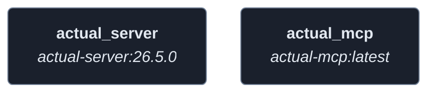
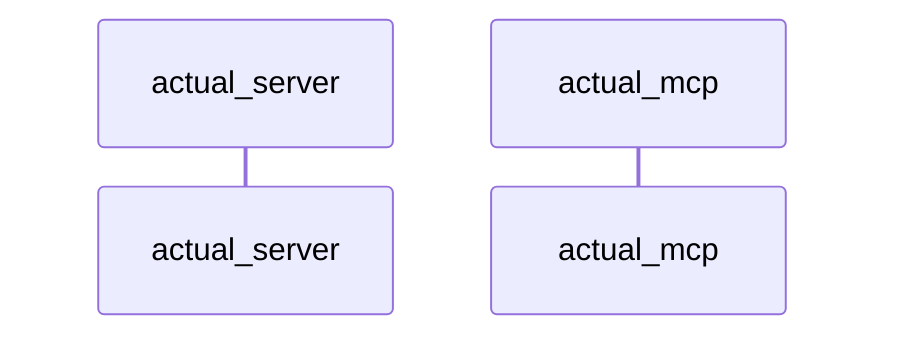
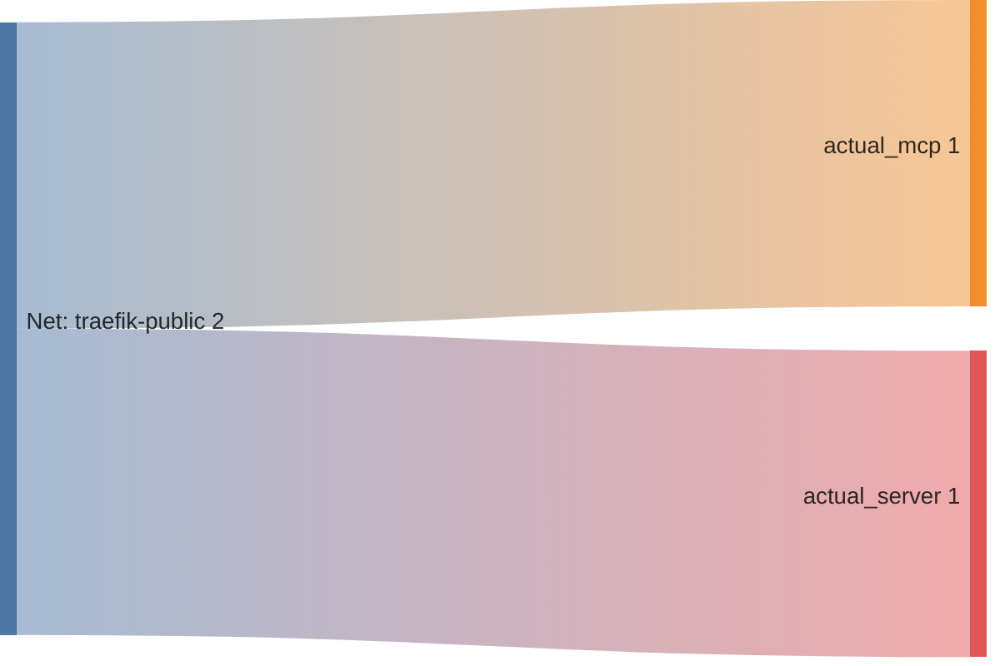

<!-- DOCKUMENTOR START -->
# Architecture

---

## Service Topology



---

## Startup Sequence



---

## Services


### actual_server

**Image:** `docker.io/actualbudget/actual-server:26.5.0`


| Property | Value |
|----------|-------|
| **Networks** | traefik-public |
| **Depends on** | — |


**Environment:**

```
ACTUAL_UPLOAD_FILE_SYNC_SIZE_LIMIT_MB=20
ACTUAL_UPLOAD_SYNC_ENCRYPTED_FILE_SYNC_SIZE_LIMIT_MB=50
ACTUAL_UPLOAD_FILE_SIZE_LIMIT_MB=20
DEBUG=actual:config
```


**Volumes:**

- `budget:/data`
- `ssl_certs:/certs`


---

### actual_mcp

**Image:** `sstefanov/actual-mcp:latest`


**Command:** `['--sse']`


| Property | Value |
|----------|-------|
| **Networks** | traefik-public |
| **Depends on** | — |


**Environment:**

```
ACTUAL_SERVER_URL=http://actual_server:5006
ACTUAL_PASSWORD=${ACTUAL_PASSWORD}
ACTUAL_BUDGET_SYNC_ID=${ACTUAL_BUDGET_SYNC_ID}
ACTUAL_BUDGET_ENCRYPTION_PASSWORD=${ACTUAL_BUDGET_ENCRYPTION_PASSWORD}
```


**Volumes:**

- `mcp_data:/data`


---


## Network Flow


<!-- DOCKUMENTOR END -->
