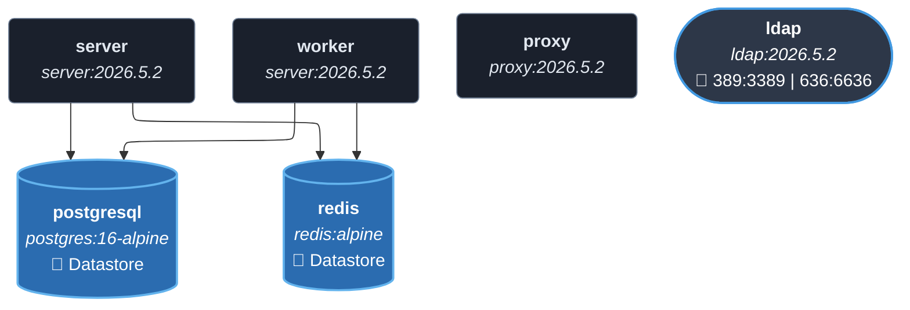
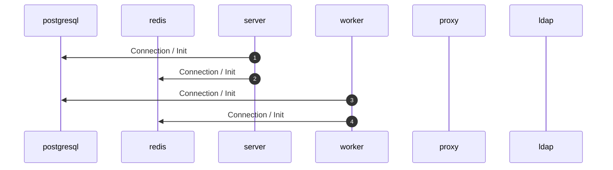
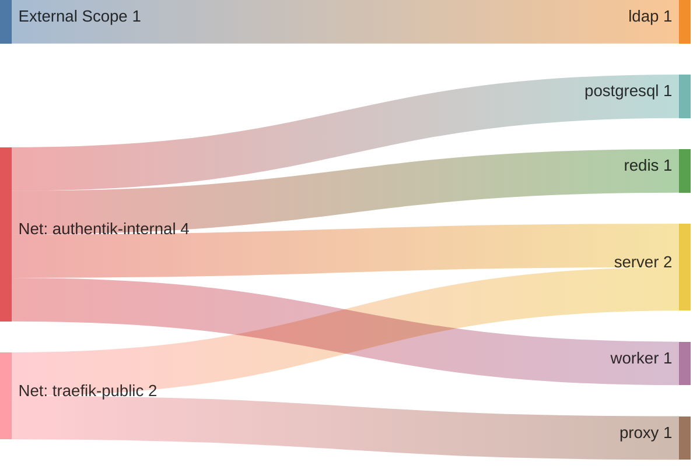

<!-- DOCKUMENTOR START -->
# Architecture

---

## Service Topology



---

## Startup Sequence



---

## Services


### postgresql

**Image:** `docker.io/library/postgres:16-alpine`


| Property | Value |
|----------|-------|
| **Networks** | authentik-internal |
| **Depends on** | — |


**Environment:**

```
POSTGRES_PASSWORD=${AUTHENTIK_POSTGRES_PASSWORD}
POSTGRES_USER=authentik
POSTGRES_DB=authentik
```


**Volumes:**

- `postgresql:/var/lib/postgresql/data`


---

### redis

**Image:** `docker.io/library/redis:alpine`


**Command:** `--save 60 1 --loglevel warning`


| Property | Value |
|----------|-------|
| **Networks** | authentik-internal |
| **Depends on** | — |


**Volumes:**

- `redis:/data`


---

### server

**Image:** `ghcr.io/goauthentik/server:2026.5.2`


**Command:** `server`


| Property | Value |
|----------|-------|
| **Networks** | authentik-internal, traefik-public |
| **Depends on** | postgresql, redis |


**Environment:**

```
AUTHENTIK_REDIS__HOST=redis
AUTHENTIK_POSTGRESQL__HOST=postgresql
AUTHENTIK_POSTGRESQL__USER=authentik
AUTHENTIK_POSTGRESQL__NAME=authentik
AUTHENTIK_POSTGRESQL__PASSWORD=${AUTHENTIK_POSTGRES_PASSWORD}
AUTHENTIK_SECRET_KEY=${AUTHENTIK_SECRET_KEY}
```


**Volumes:**

- `media:/media`
- `custom-templates:/templates`


---

### worker

**Image:** `ghcr.io/goauthentik/server:2026.5.2`


**Command:** `worker`


| Property | Value |
|----------|-------|
| **Networks** | authentik-internal |
| **Depends on** | postgresql, redis |


**Environment:**

```
AUTHENTIK_REDIS__HOST=redis
AUTHENTIK_POSTGRESQL__HOST=postgresql
AUTHENTIK_POSTGRESQL__USER=authentik
AUTHENTIK_POSTGRESQL__NAME=authentik
AUTHENTIK_POSTGRESQL__PASSWORD=${AUTHENTIK_POSTGRES_PASSWORD}
AUTHENTIK_SECRET_KEY=${AUTHENTIK_SECRET_KEY}
```


**Volumes:**

- `/var/run/docker.sock:/var/run/docker.sock`
- `media:/media`
- `certs:/certs`
- `custom-templates:/templates`


---

### proxy

**Image:** `ghcr.io/goauthentik/proxy:2026.5.2`


| Property | Value |
|----------|-------|
| **Networks** | traefik-public |
| **Depends on** | — |


**Environment:**

```
AUTHENTIK_HOST=https://auth.${BASE_DOMAIN}
AUTHENTIK_INSECURE=false
AUTHENTIK_TOKEN=${AUTHENTIK_OUTPOST_TOKEN}
```


---

### ldap

**Image:** `ghcr.io/goauthentik/ldap:2026.5.2`


| Property | Value |
|----------|-------|
| **Networks** | traefik-public |
| **Depends on** | — |
| **Ports** | External: 389:3389 External: 636:6636 |


**Environment:**

```
AUTHENTIK_HOST=https://auth.${BASE_DOMAIN}
AUTHENTIK_INSECURE=false
AUTHENTIK_TOKEN=${AUTHENTIK_LDAP_TOKEN}
```


---


## Network Flow


<!-- DOCKUMENTOR END -->
