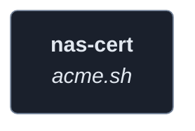
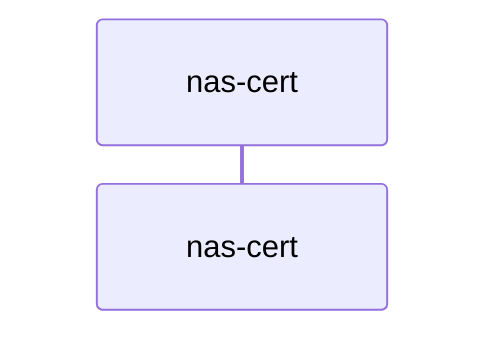
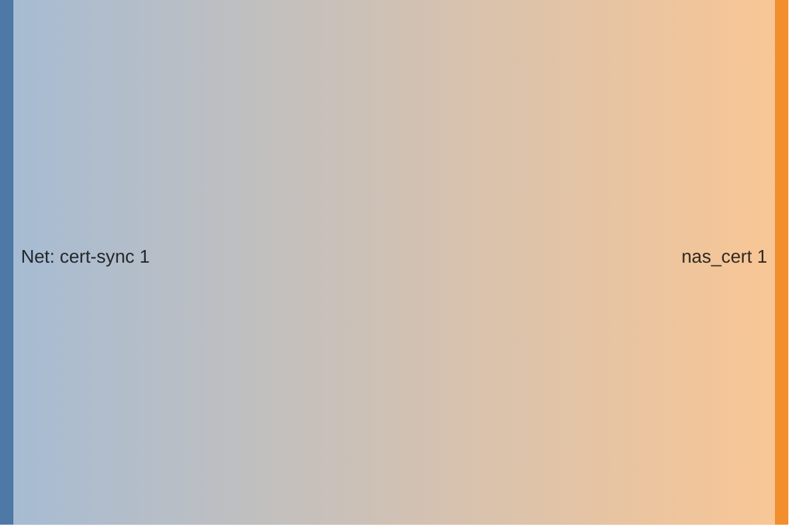

<!-- DOCKUMENTOR START -->
# Architecture

---

## Service Topology



---

## Startup Sequence



---

## Services


### nas-cert

**Image:** `neilpang/acme.sh`


**Command:** `sh -c " apk add --no-cache openssh-client bash && mkdir -p /root/.ssh && if [ -f /ssh-key/id_rsa ]; then
  cp /ssh-key/id_rsa /root/.ssh/id_rsa &&
  chmod 600 /root/.ssh/id_rsa;
fi && chmod 700 /root/.ssh && echo 'Issuing certificate for nas.${BASE_DOMAIN:-example.com}...' && (acme.sh --issue --dns dns_cf -d nas.${BASE_DOMAIN:-example.com} --server letsencrypt || echo 'Certificate already exists, skipping...') && echo 'Running initial sync to NAS...' && /scripts/sync-nas-cert.sh && echo 'Installing crontab for weekly renewal and sync...' && echo '0 3 * * 0 acme.sh --renew -d nas.${BASE_DOMAIN:-example.com} && /scripts/sync-nas-cert.sh || exit 1' > /etc/crontabs/root && echo 'Starting cron daemon...' && crond -f "
`


| Property | Value |
|----------|-------|
| **Networks** | cert-sync |
| **Depends on** | — |


**Environment:**

```
CF_Token=${CLOUDFLARE_DNS_API_TOKEN}
NAS_HOST=nas.${BASE_DOMAIN:-example.com}
NAS_USER=${NAS_USER:-root}
CERT_DOMAIN=nas.${BASE_DOMAIN:-example.com}
SSH_KEY_FILE=/root/.ssh/id_rsa
TZ=${TZ:-America/New_York}
```


**Volumes:**

- `acme_certs:/acme.sh`
- `./sync-nas-cert.sh:/scripts/sync-nas-cert.sh:ro`
- `./common:/scripts/common:ro`


---


## Network Flow


<!-- DOCKUMENTOR END -->
