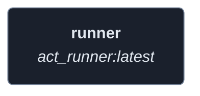
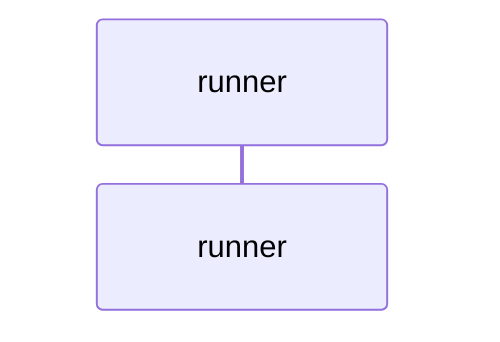
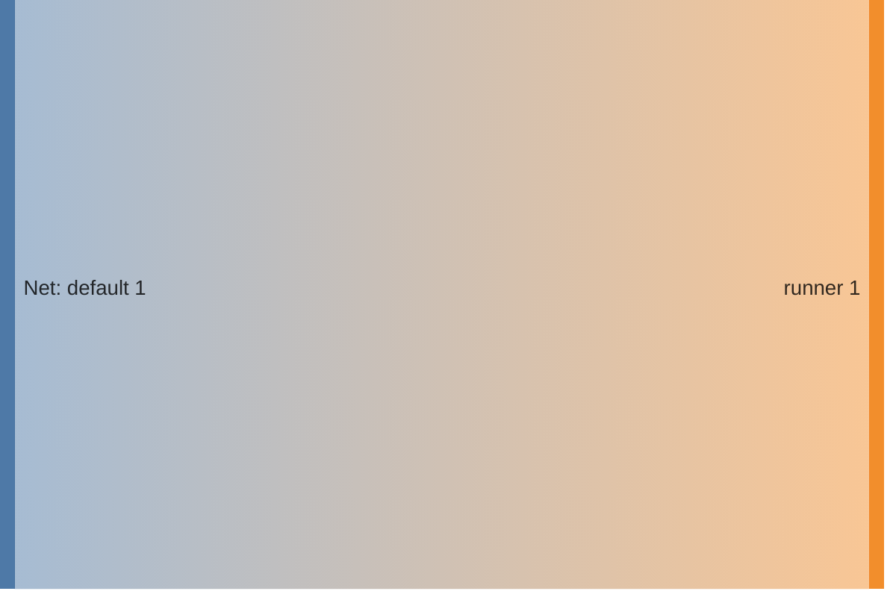

<!-- DOCKUMENTOR START -->
# Architecture

---

## Service Topology



---

## Startup Sequence



---

## Services


### runner

**Image:** `gitea/act_runner:latest`


| Property | Value |
|----------|-------|
| **Networks** | default |
| **Depends on** | — |


**Environment:**

```
GITEA_INSTANCE_URL=https://git.${BASE_DOMAIN}
GITEA_RUNNER_REGISTRATION_TOKEN=${FORGEJO_RUNNER_TOKEN}
GITEA_RUNNER_NAME=homelab-runner
GITEA_RUNNER_LABELS=ubuntu-latest:docker://node:16-bullseye,self-hosted
```


**Volumes:**

- `runner-data:/data`
- `/var/run/docker.sock:/var/run/docker.sock`


---


## Network Flow


<!-- DOCKUMENTOR END -->
