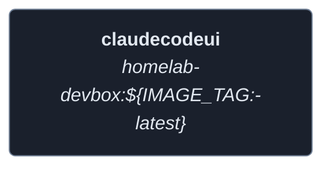
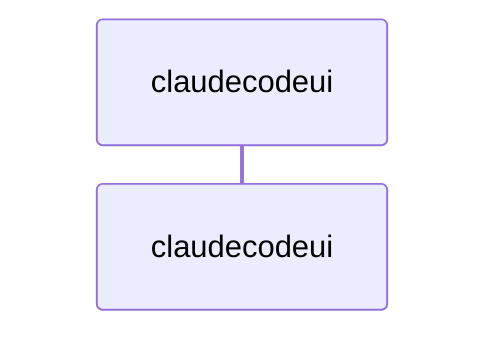
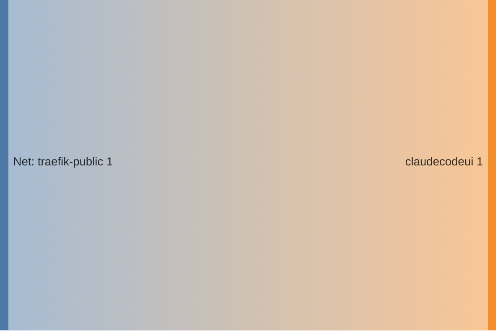

<!-- DOCKUMENTOR START -->
# Architecture

---

## Service Topology



---

## Startup Sequence



---

## Services


### claudecodeui

**Image:** `${REGISTRY_URL:-ghcr.io}/${GITHUB_USERNAME}/homelab-devbox:${IMAGE_TAG:-latest}`


**Command:** `/bin/bash -c "export PATH=$$HOME/.local/share/fnm:$$PATH && eval \"\$$(fnm env --use-on-cd)\" && mkdir -p ~/.claude ~/.config/gemini ~/.cloudcli ~/.forge && cloudcli start"`


| Property | Value |
|----------|-------|
| **Networks** | traefik-public |
| **Depends on** | — |


**Environment:**

```
TZ=${TZ:-America/New_York}
PORT=3001
NODE_ENV=production
VITE_IS_PLATFORM=true
WORKSPACES_ROOT=/home/coder/workspace
OPENROUTER_KEY=${OPENROUTER_KEY}
```


**Volumes:**

- `workspace:/home/coder/workspace`
- `claude_config:/home/coder/.claude`
- `gemini_config:/home/coder/.config/gemini`
- `cloudcli_config:/home/coder/.cloudcli`
- `forge_config:/home/coder/.forge`
- `shared_ssh:/home/coder/.ssh`


---


## Network Flow


<!-- DOCKUMENTOR END -->
