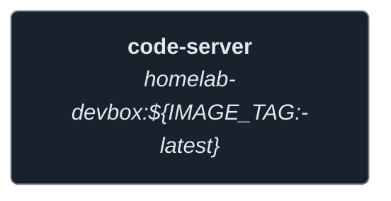
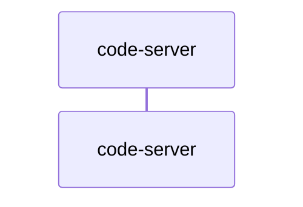
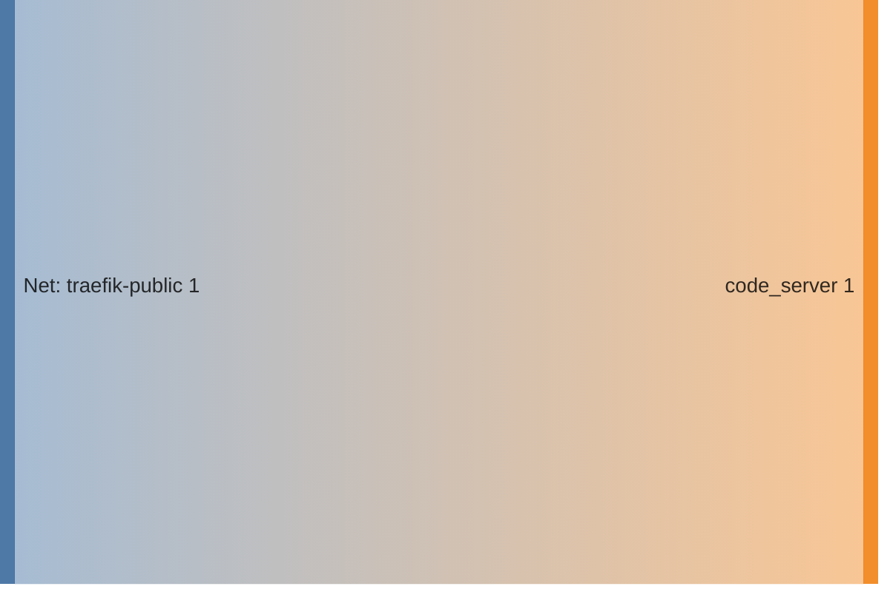

<!-- DOCKUMENTOR START -->
# Architecture

---

## Service Topology



---

## Startup Sequence



---

## Services


### code-server

**Image:** `${REGISTRY_URL:-ghcr.io}/${GITHUB_USERNAME}/homelab-devbox:${IMAGE_TAG:-latest}`


**Command:** `code-server --auth none --bind-addr 0.0.0.0:3001 /home/coder/workspace`


| Property | Value |
|----------|-------|
| **Networks** | traefik-public |
| **Depends on** | — |


**Environment:**

```
TZ=${TZ:-America/New_York}
NVIDIA_VISIBLE_DEVICES=all
NVIDIA_DRIVER_CAPABILITIES=compute,utility
```


**Volumes:**

- `code_server_config:/home/coder/.config/code-server`
- `workspace:/home/coder/workspace`
- `shared_ssh:/home/coder/.ssh`


---


## Network Flow


<!-- DOCKUMENTOR END -->
