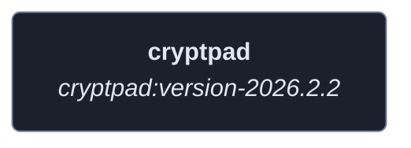
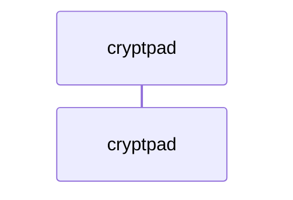
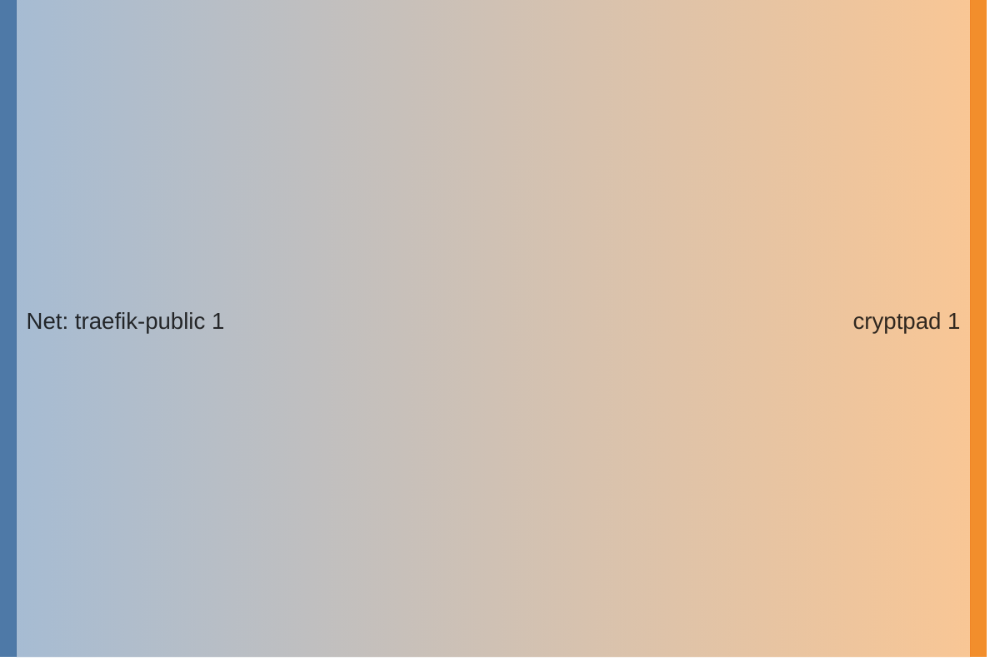

<!-- DOCKUMENTOR START -->
# Architecture

---

## Service Topology



---

## Startup Sequence



---

## Services


### cryptpad

**Image:** `cryptpad/cryptpad:version-2026.2.2`


| Property | Value |
|----------|-------|
| **Networks** | traefik-public |
| **Depends on** | — |


**Environment:**

```
CPAD_MAIN_DOMAIN=https://cryptpad.${BASE_DOMAIN}
CPAD_SANDBOX_DOMAIN=https://cryptpad-sandbox.${BASE_DOMAIN}
CPAD_CONF=/cryptpad/config/config.js
CPAD_INSTALL_ONLYOFFICE=yes
```


**Volumes:**

- `cryptpad-config:/cryptpad/config`
- `cryptpad-data:/cryptpad/data`


---


## Network Flow


<!-- DOCKUMENTOR END -->
