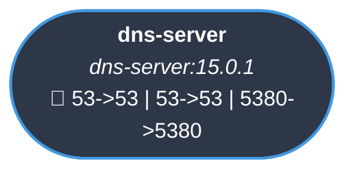
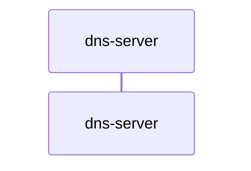
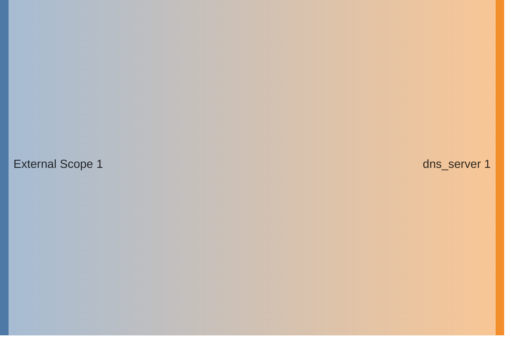

<!-- DOCKUMENTOR START -->
# Architecture

---

## Service Topology



---

## Startup Sequence



---

## Services


### dns-server

**Image:** `technitium/dns-server:15.0.1`


| Property | Value |
|----------|-------|
| **Networks** | traefik-public |
| **Depends on** | — |
| **Ports** | External: 53->53 External: 53->53 External: 5380->5380 |


**Environment:**

```
DNS_SERVER_DOMAIN=dns.${BASE_DOMAIN}
DNS_SERVER_ADMIN_PASSWORD=${DNS_ADMIN_PASSWORD:-admin}
DNS_SERVER_PREFER_IPV6=false
DNS_SERVER_WEB_SERVICE_LOCAL_ADDRESSES=0.0.0.0
DNS_SERVER_RECURSION=UseLocalAllowList
DNS_SERVER_RECURSION_ALLOWED_NETWORKS=127.0.0.0/8,10.0.0.0/8,172.16.0.0/12,192.168.0.0/16,100.64.0.0/10
DNS_SERVER_ENABLE_BLOCKING=true
DNS_SERVER_FORWARDERS=${DNS_SERVER_FORWARDERS}
DNS_SERVER_LOG_QUERIES=false
DNS_SERVER_WEB_SERVICE_HTTP_PORT=5380
ASPNETCORE_HTTP_PORTS=5380
```


**Volumes:**

- `dns-config:/etc/dns`


---


## Network Flow


<!-- DOCKUMENTOR END -->
