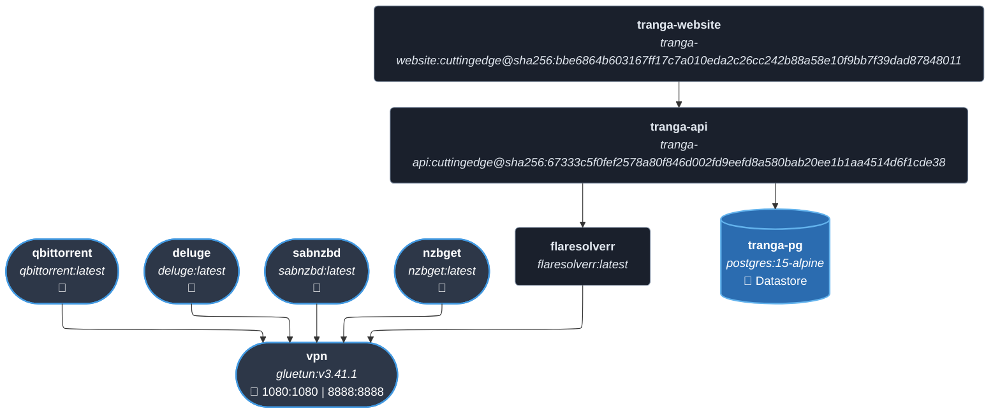
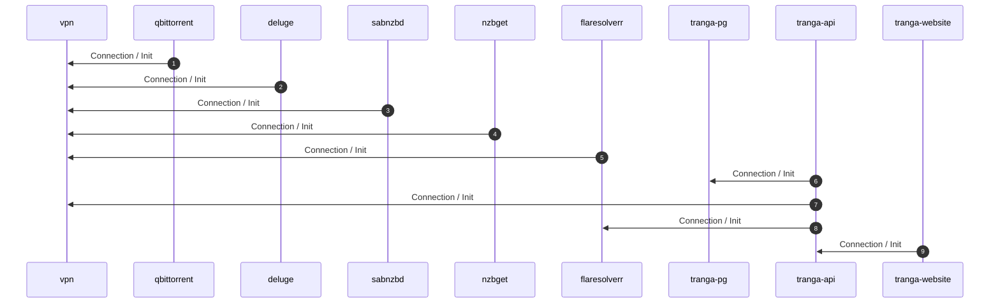
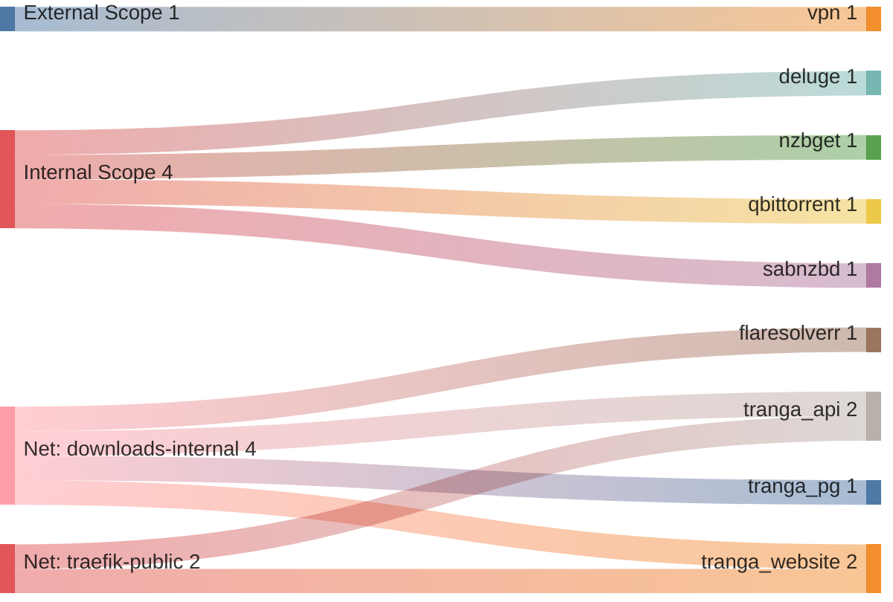

<!-- DOCKUMENTOR START -->
# Architecture

---

## Service Topology



---

## Startup Sequence



---

## Services


### vpn

**Image:** `qmcgaw/gluetun:v3.41.1`


| Property | Value |
|----------|-------|
| **Networks** | traefik-public, downloads-internal |
| **Depends on** | — |
| **Ports** | External: 1080:1080 External: 8888:8888 |


**Environment:**

```
VPN_SERVICE_PROVIDER=${DOWNLOADS_VPN_SERVICE_PROVIDER}
VPN_TYPE=${DOWNLOADS_VPN_TYPE}
OPENVPN_USER=${DOWNLOADS_OPENVPN_USER}
OPENVPN_PASSWORD=${DOWNLOADS_OPENVPN_PASSWORD}
SERVER_COUNTRIES=${DOWNLOADS_VPN_SERVER_COUNTRIES}
SERVER_CATEGORIES=${DOWNLOADS_VPN_SERVER_CATEGORIES}
SERVER_CITIES=${DOWNLOADS_VPN_SERVER_CITIES}
FIREWALL_OUTBOUND_SUBNETS=${LOCAL_SUBNET},${DOWNLOADS_DOCKER_SUBNET}
HTTPPROXY=on
HTTPPROXY_LISTENING_ADDRESS=:8888
TZ=${TZ}
```


---

### qbittorrent

**Image:** `lscr.io/linuxserver/qbittorrent:latest`


| Property | Value |
|----------|-------|
| **Networks** | traefik-public, downloads-internal |
| **Depends on** | vpn |
| **Ports** | Internal: 8080 |


**Environment:**

```
PUID=${PUID}
PGID=${PGID}
TZ=${TZ}
WEBUI_PORT=8080
```


**Volumes:**

- `qbittorrent:/config`
- `torrents:/data/torrents`


---

### deluge

**Image:** `lscr.io/linuxserver/deluge:latest`


| Property | Value |
|----------|-------|
| **Networks** | traefik-public, downloads-internal |
| **Depends on** | vpn |
| **Ports** | Internal: 8112 Internal: 58846 |


**Environment:**

```
PUID=${PUID}
PGID=${PGID}
UMASK=002
DELUGE_LOGLEVEL=info
```


**Volumes:**

- `deluge:/config`
- `torrents:/data/torrents`


---

### sabnzbd

**Image:** `lscr.io/linuxserver/sabnzbd:latest`


| Property | Value |
|----------|-------|
| **Networks** | traefik-public, downloads-internal |
| **Depends on** | vpn |
| **Ports** | Internal: 8080 |


**Environment:**

```
PUID=${PUID}
PGID=${PGID}
TZ=${TZ}
BASE_DOMAIN=${BASE_DOMAIN}
```


**Volumes:**

- `sabnzbd:/config`
- `usenet:/data/usenet`


---

### nzbget

**Image:** `lscr.io/linuxserver/nzbget:latest`


| Property | Value |
|----------|-------|
| **Networks** | traefik-public, downloads-internal |
| **Depends on** | vpn |
| **Ports** | Internal: 6789 |


**Environment:**

```
PUID=${PUID}
PGID=${PGID}
TZ=${TZ}
```


**Volumes:**

- `nzbget:/config`
- `usenet:/data/usenet`


---

### flaresolverr

**Image:** `ghcr.io/flaresolverr/flaresolverr:latest`


| Property | Value |
|----------|-------|
| **Networks** | downloads-internal |
| **Depends on** | vpn |


**Environment:**

```
TZ=${TZ}
LOG_LEVEL=${DOWNLOADS_FLARESOLVERR_LOG_LEVEL}
HEADLESS=true
HTTP_PROXY=http://vpn:8888
HTTPS_PROXY=http://vpn:8888
NO_PROXY=localhost,127.0.0.1
```


---

### tranga-pg

**Image:** `postgres:15-alpine`


| Property | Value |
|----------|-------|
| **Networks** | downloads-internal |
| **Depends on** | — |


**Environment:**

```
POSTGRES_USER=${DOWNLOADS_TRANGA_DB_USER}
POSTGRES_PASSWORD=${DOWNLOADS_TRANGA_DB_PASSWORD}
POSTGRES_DB=${DOWNLOADS_TRANGA_DB_NAME}
```


**Volumes:**

- `tranga_pg:/var/lib/postgresql/data`


---

### tranga-api

**Image:** `ghcr.io/chutch3/tranga-api:cuttingedge@sha256:67333c5f0fef2578a80f846d002fd9eefd8a580bab20ee1b1aa4514d6f1cde38`


| Property | Value |
|----------|-------|
| **Networks** | traefik-public, downloads-internal |
| **Depends on** | tranga-pg, vpn, flaresolverr |


**Environment:**

```
POSTGRES_HOST=tranga-pg:5432
POSTGRES_USER=${DOWNLOADS_TRANGA_DB_USER}
POSTGRES_PASSWORD=${DOWNLOADS_TRANGA_DB_PASSWORD}
POSTGRES_DB=${DOWNLOADS_TRANGA_DB_NAME}
HTTP_PROXY=http://vpn:8888
HTTPS_PROXY=http://vpn:8888
NO_PROXY=localhost,127.0.0.1
TZ=${TZ}
```


**Volumes:**

- `torrents:/Manga`


---

### tranga-website

**Image:** `ghcr.io/chutch3/tranga-website:cuttingedge@sha256:bbe6864b603167ff17c7a010eda2c26cc242b88a58e10f9bb7f39dad87848011`


| Property | Value |
|----------|-------|
| **Networks** | traefik-public, downloads-internal |
| **Depends on** | tranga-api |


**Environment:**

```
TRANGA_API_URL=http://tranga-api:6531
```


---


## Network Flow


<!-- DOCKUMENTOR END -->
