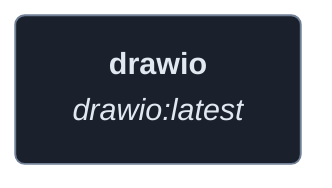
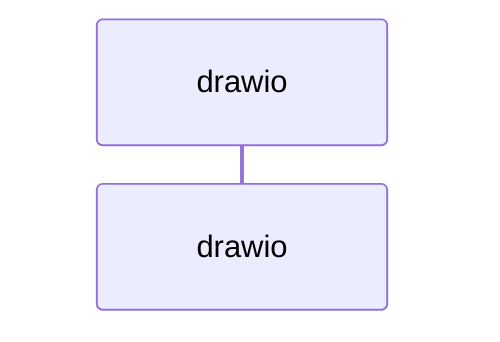
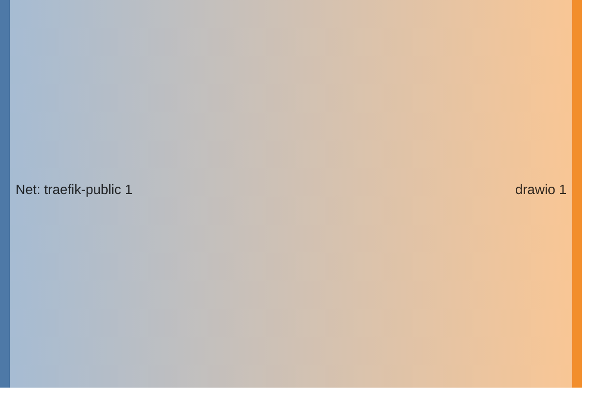

<!-- DOCKUMENTOR START -->
# Architecture

---

## Service Topology

---

## Startup Sequence

---

## Services

### drawio

**Image:** `jgraph/drawio:latest`

| Property | Value |
|----------|-------|
| **Networks** | traefik-public |
| **Depends on** | — |

---

## Network Flow

<!-- DOCKUMENTOR END -->
