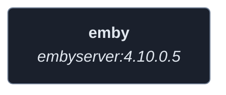
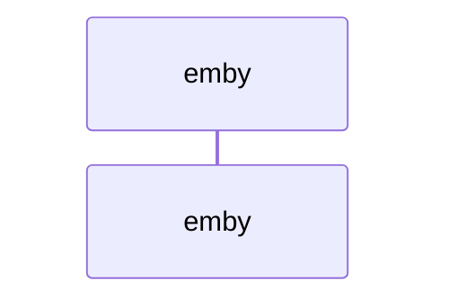
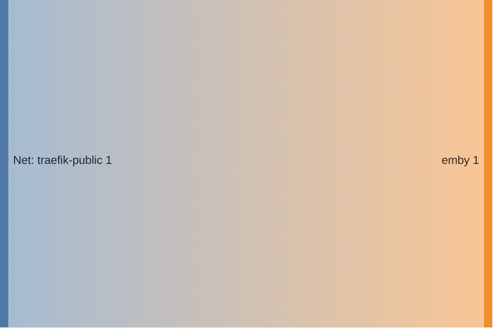

<!-- DOCKUMENTOR START -->
# Architecture

---

## Service Topology



---

## Startup Sequence



---

## Services


### emby

**Image:** `emby/embyserver:4.10.0.5`


| Property | Value |
|----------|-------|
| **Networks** | traefik-public |
| **Depends on** | — |


**Environment:**

```
UID=0
GID=1000
GIDLIST=1000
```


**Volumes:**

- `emby:/config`
- `all_data:/mnt/external`


---


## Network Flow


<!-- DOCKUMENTOR END -->
