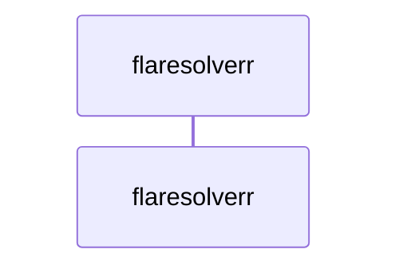
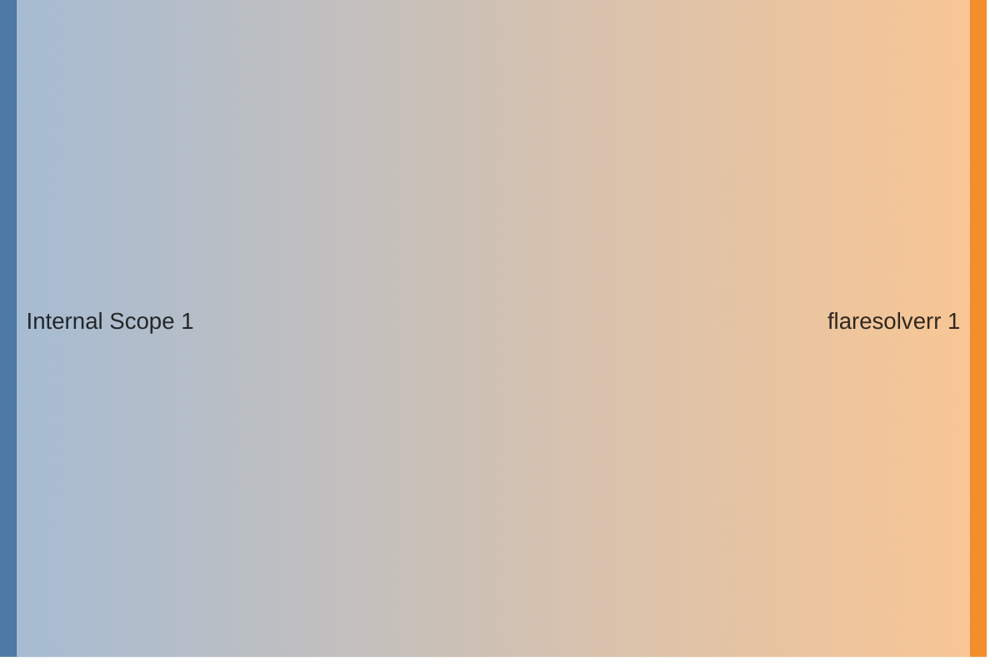

<!-- DOCKUMENTOR START -->
# Architecture

---

## Service Topology


---

## Startup Sequence



---

## Services


### flaresolverr

**Image:** `ghcr.io/flaresolverr/flaresolverr:latest`


| Property | Value |
|----------|-------|
| **Networks** | traefik-public |
| **Depends on** | — |
| **Ports** | Internal: 8191 |


**Environment:**

```
PUID=1000
PGID=1000
TZ=${TZ}
LOG_LEVEL=${FLARESOLVERR_LOG_LEVEL:-info}
HEADLESS=true
```


**Volumes:**

- `flaresolverr:/config`


---


## Network Flow


<!-- DOCKUMENTOR END -->
