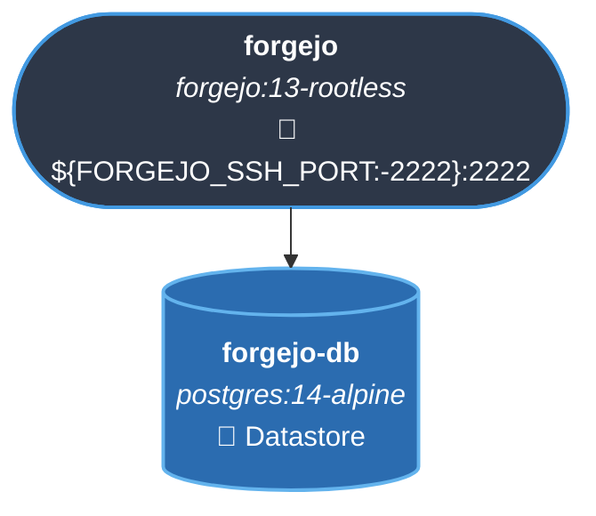
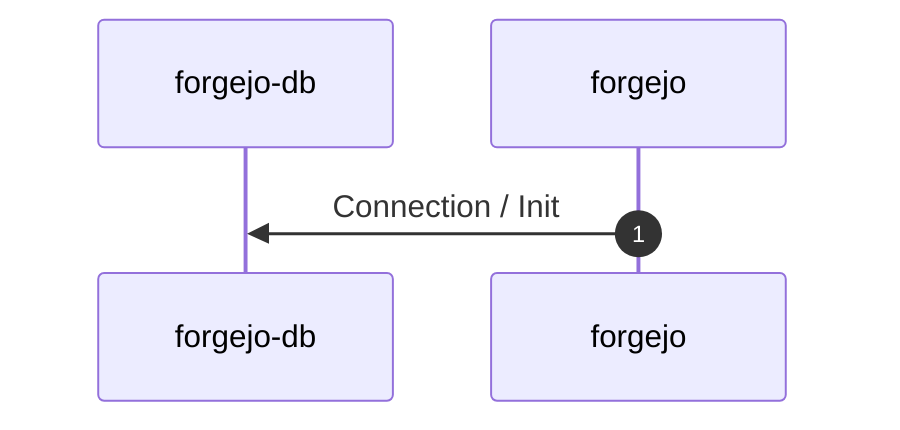
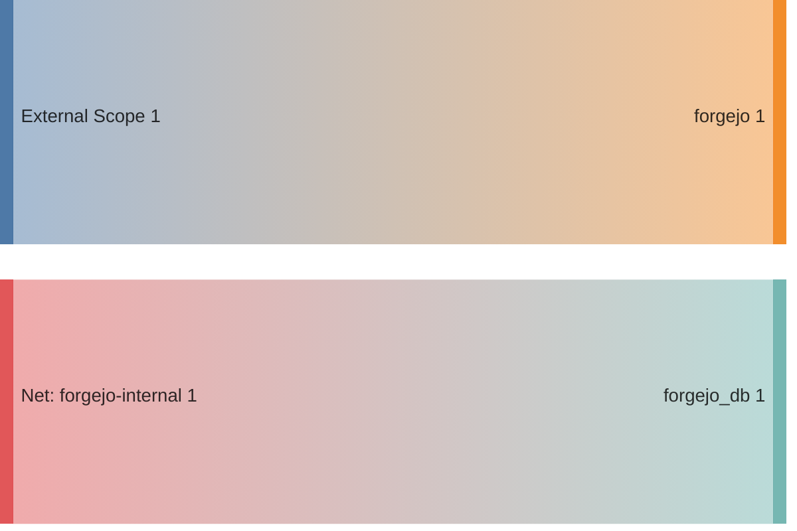

<!-- DOCKUMENTOR START -->
# Architecture

---

## Service Topology



---

## Startup Sequence



---

## Services


### forgejo-db

**Image:** `postgres:14-alpine`


| Property | Value |
|----------|-------|
| **Networks** | forgejo-internal |
| **Depends on** | — |


**Environment:**

```
POSTGRES_USER=${FORGEJO_DB_USER:-forgejo}
POSTGRES_PASSWORD=${FORGEJO_DB_PASSWORD}
POSTGRES_DB=${FORGEJO_DB_NAME:-forgejo}
```


**Volumes:**

- `forgejo_db:/var/lib/postgresql/data`


---

### forgejo

**Image:** `codeberg.org/forgejo/forgejo:13-rootless`


| Property | Value |
|----------|-------|
| **Networks** | forgejo-internal, traefik-public |
| **Depends on** | forgejo-db |
| **Ports** | External: ${FORGEJO_SSH_PORT:-2222}:2222 |


**Environment:**

```
USER_UID=1000
USER_GID=1000
FORGEJO__database__DB_TYPE=postgres
FORGEJO__database__HOST=forgejo-db:5432
FORGEJO__database__NAME=${FORGEJO_DB_NAME:-forgejo}
FORGEJO__database__USER=${FORGEJO_DB_USER:-forgejo}
FORGEJO__database__PASSWD=${FORGEJO_DB_PASSWORD}
FORGEJO__server__DOMAIN=git.${BASE_DOMAIN}
FORGEJO__server__SSH_DOMAIN=git.${BASE_DOMAIN}
FORGEJO__server__ROOT_URL=https://git.${BASE_DOMAIN}/
FORGEJO__server__SSH_PORT=${FORGEJO_SSH_PORT:-2222}
FORGEJO__server__SSH_LISTEN_PORT=2222
FORGEJO__openid__ENABLE_OPENID_SIGNIN=true
FORGEJO__openid__ENABLE_OPENID_SIGNUP=true
FORGEJO__service__DISABLE_REGISTRATION=false
FORGEJO__service__ALLOW_ONLY_EXTERNAL_REGISTRATION=false
```


**Volumes:**

- `forgejo_data:/var/lib/gitea`
- `forgejo_config:/etc/gitea`


---


## Network Flow


<!-- DOCKUMENTOR END -->
