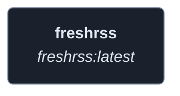
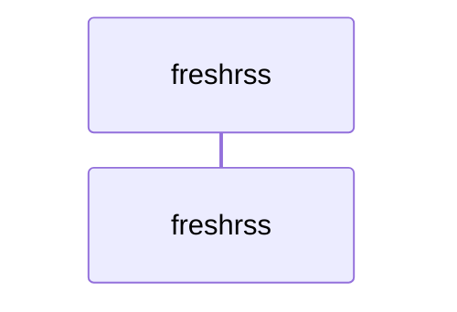
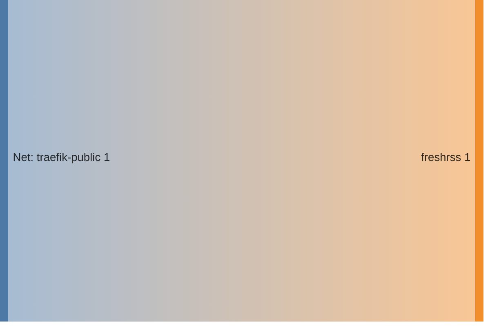

<!-- DOCKUMENTOR START -->
# Architecture

---

## Service Topology



---

## Startup Sequence



---

## Services


### freshrss

**Image:** `freshrss/freshrss:latest`


| Property | Value |
|----------|-------|
| **Networks** | traefik-public |
| **Depends on** | — |


**Environment:**

```
TZ=${TZ}
FRESHRSS_ENV=production
CRON_MIN=4,34
FRESHRSS_INSTALL=--api-enabled --auth-type http_auth --default-user ${FRESHRSS_DEFAULT_USER:-admin}
FRESHRSS_USER=--user ${FRESHRSS_DEFAULT_USER:-admin} --password ${FRESHRSS_ADMIN_PASSWORD} --api-password ${FRESHRSS_ADMIN_API_PASSWORD} --email ${FRESHRSS_ADMIN_EMAIL}
OIDC_ENABLED=1
OIDC_PROVIDER_METADATA_URL=https://auth.${BASE_DOMAIN}/application/o/freshrss/.well-known/openid-configuration
OIDC_CLIENT_ID=${FRESHRSS_OAUTH_CLIENT_ID}
OIDC_CLIENT_SECRET=${FRESHRSS_OAUTH_CLIENT_SECRET}
OIDC_CLIENT_CRYPTO_KEY=${FRESHRSS_OAUTH_CRYPTO_KEY}
OIDC_SCOPES=openid email profile
OIDC_REMOTE_USER_CLAIM=preferred_username
OIDC_X_FORWARDED_HEADERS=X-Forwarded-Host X-Forwarded-Port X-Forwarded-Proto
TRUSTED_PROXY=${FRESHRSS_TRUSTED_PROXY:-10.0.0.0/8}
```


**Volumes:**

- `freshrss_data:/var/www/FreshRSS/data`
- `freshrss_extensions:/var/www/FreshRSS/extensions`


---


## Network Flow


<!-- DOCKUMENTOR END -->
