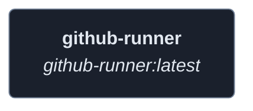
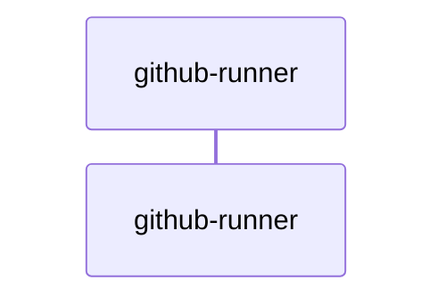
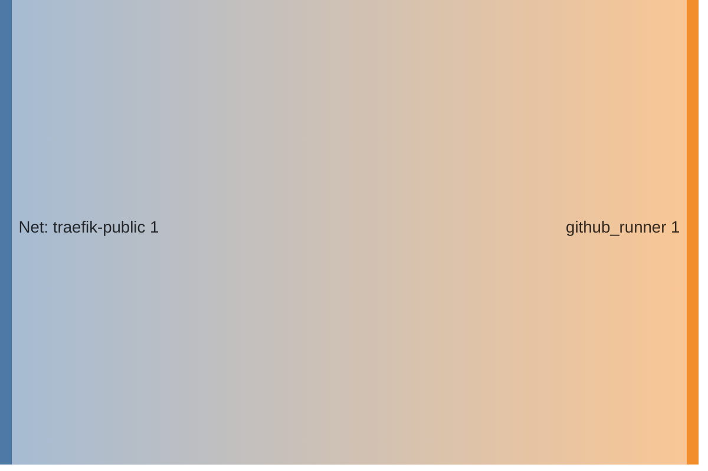

<!-- DOCKUMENTOR START -->
# Architecture

---

## Service Topology



---

## Startup Sequence



---

## Services


### github-runner

**Image:** `myoung34/github-runner:latest`


| Property | Value |
|----------|-------|
| **Networks** | traefik-public |
| **Depends on** | — |


**Environment:**

```
REPO_URL=https://github.com/${GITHUB_USERNAME}/${GITHUB_REPO:-homelab}
ACCESS_TOKEN=${GITHUB_TOKEN}
RUNNER_NAME=homelab-gh-runner
RUNNER_OPTIMIZE_REPOSITORY_CHECKOUT=true
DOCKER_ENABLED=true
```


**Volumes:**

- `/var/run/docker.sock:/var/run/docker.sock`
- `github-runner-data:/data`


---


## Network Flow


<!-- DOCKUMENTOR END -->
