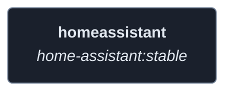
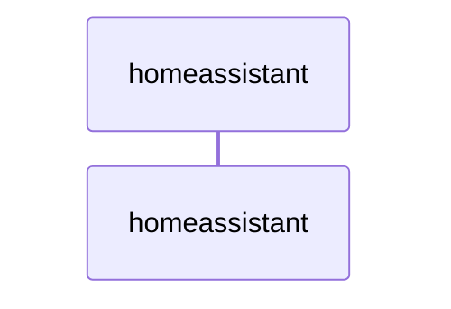
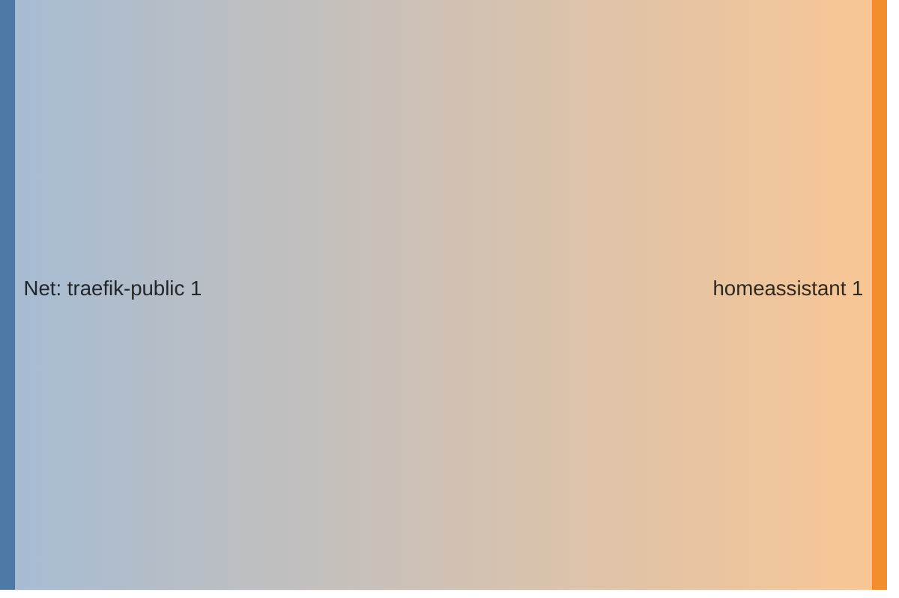

<!-- DOCKUMENTOR START -->
# Architecture

---

## Service Topology

---

## Startup Sequence

---

## Services

### homeassistant

**Image:** `ghcr.io/home-assistant/home-assistant:stable`

| Property | Value |
|----------|-------|
| **Networks** | traefik-public |
| **Depends on** | — |

**Volumes:**

- `homeassistant:/config`
- `/etc/localtime:/etc/localtime:ro`

---

## Network Flow

<!-- DOCKUMENTOR END -->
