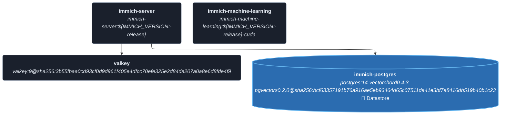
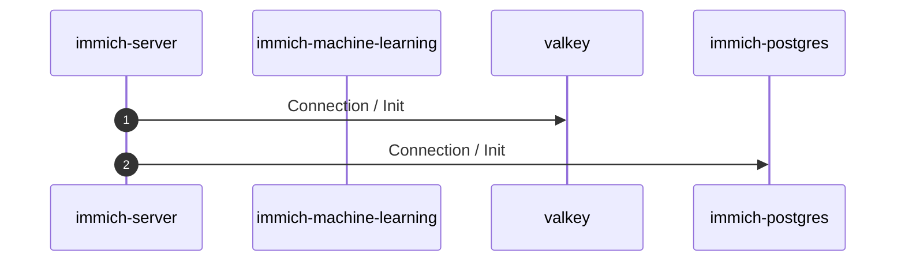
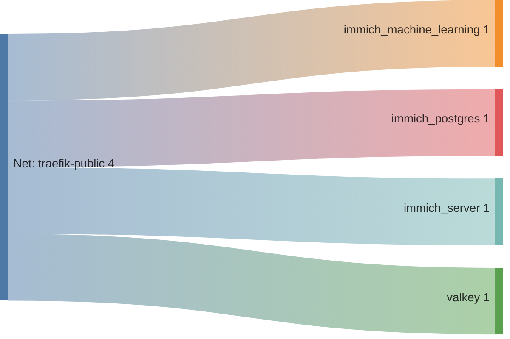

<!-- DOCKUMENTOR START -->
# Architecture

---

## Service Topology



---

## Startup Sequence



---

## Services


### immich-server

**Image:** `ghcr.io/immich-app/immich-server:${IMMICH_VERSION:-release}`


| Property | Value |
|----------|-------|
| **Networks** | traefik-public |
| **Depends on** | valkey, immich-postgres |


**Environment:**

```
DB_HOSTNAME=immich-postgres
DB_USERNAME=${IMMICH_DB_USERNAME:-postgres}
DB_PASSWORD=${IMMICH_DB_PASSWORD}
DB_DATABASE_NAME=${IMMICH_DB_DATABASE_NAME:-immich}
REDIS_HOSTNAME=valkey
TZ=${TZ:-UTC}
UPLOAD_LOCATION=/usr/src/app/upload
OAUTH_ENABLED=true
OAUTH_ISSUER_URL=https://auth.${BASE_DOMAIN}/application/o/immich/
OAUTH_CLIENT_ID=${IMMICH_OAUTH_CLIENT_ID}
OAUTH_CLIENT_SECRET=${IMMICH_OAUTH_CLIENT_SECRET}
OAUTH_AUTO_REGISTER=true
OAUTH_BUTTON_TEXT=Login with Authentik
OAUTH_SCOPE=openid email profile
```


**Volumes:**

- `immich_upload:/usr/src/app/upload`
- `all_data:/mnt/media/photos:ro`
- `/etc/localtime:/etc/localtime:ro`


---

### immich-machine-learning

**Image:** `ghcr.io/immich-app/immich-machine-learning:${IMMICH_VERSION:-release}-cuda`


| Property | Value |
|----------|-------|
| **Networks** | traefik-public |
| **Depends on** | — |


**Environment:**

```
NVIDIA_VISIBLE_DEVICES=all
```


**Volumes:**

- `immich_model_cache:/cache`


---

### valkey

**Image:** `docker.io/valkey/valkey:9@sha256:3b55fbaa0cd93cf0d9d961f405e4dfcc70efe325e2d84da207a0a8e6d8fde4f9`


**Command:** `valkey-server --stop-writes-on-bgsave-error no`


| Property | Value |
|----------|-------|
| **Networks** | traefik-public |
| **Depends on** | — |


**Volumes:**

- `immich_redis_data:/data`


---

### immich-postgres

**Image:** `ghcr.io/immich-app/postgres:14-vectorchord0.4.3-pgvectors0.2.0@sha256:bcf63357191b76a916ae5eb93464d65c07511da41e3bf7a8416db519b40b1c23`


| Property | Value |
|----------|-------|
| **Networks** | traefik-public |
| **Depends on** | — |


**Environment:**

```
POSTGRES_PASSWORD=${IMMICH_DB_PASSWORD}
POSTGRES_USER=${IMMICH_DB_USERNAME:-postgres}
POSTGRES_DB=${IMMICH_DB_DATABASE_NAME:-immich}
POSTGRES_INITDB_ARGS=--data-checksums
```


**Volumes:**

- `immich_pgdata:/var/lib/postgresql/data`


---


## Network Flow


<!-- DOCKUMENTOR END -->
