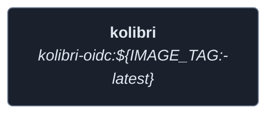
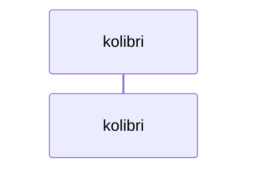
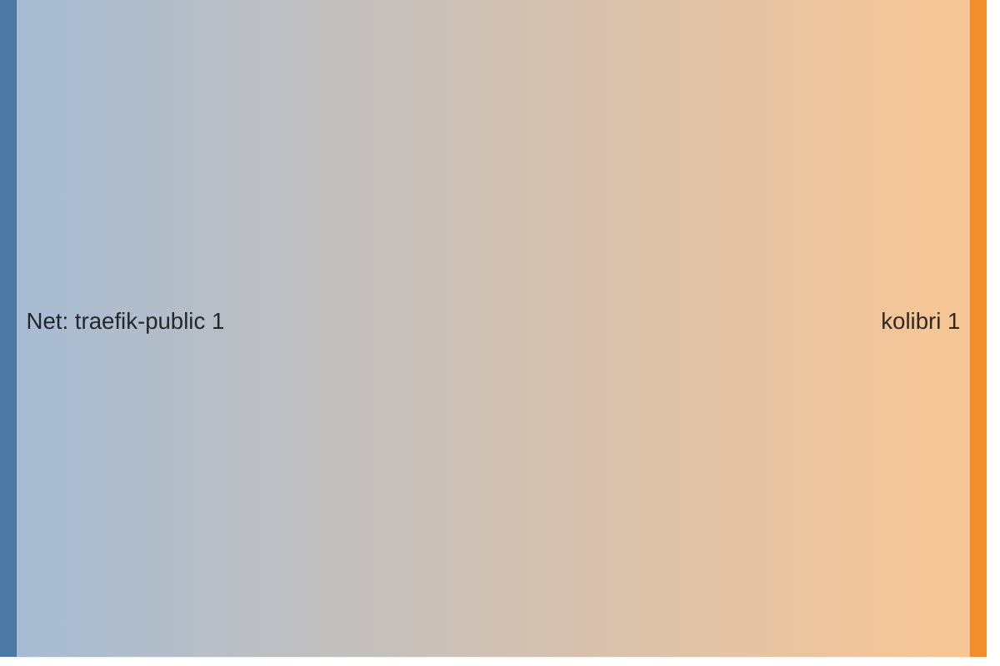

<!-- DOCKUMENTOR START -->
# Architecture

---

## Service Topology



---

## Startup Sequence



---

## Services


### kolibri

**Image:** `${REGISTRY_URL:-ghcr.io}/${REGISTRY_NAMESPACE:-your-username}/kolibri-oidc:${IMAGE_TAG:-latest}`


| Property | Value |
|----------|-------|
| **Networks** | traefik-public |
| **Depends on** | — |


**Environment:**

```
TZ=${TZ:-UTC}
PUID=${PUID:-1000}
PGID=${PGID:-1000}
KOLIBRI_HTTP_PORT=8080
CLIENT_ID=${KOLIBRI_OAUTH_CLIENT_ID}
CLIENT_SECRET=${KOLIBRI_OAUTH_CLIENT_SECRET}
KOLIBRI_OIDC_AUTHORIZATION_ENDPOINT=https://auth.${BASE_DOMAIN}/application/o/authorize/
KOLIBRI_OIDC_TOKEN_ENDPOINT=https://auth.${BASE_DOMAIN}/application/o/token/
KOLIBRI_OIDC_USERINFO_ENDPOINT=https://auth.${BASE_DOMAIN}/application/o/userinfo/
KOLIBRI_OIDC_JWKS_ENDPOINT=https://auth.${BASE_DOMAIN}/application/o/kolibri/jwks/
KOLIBRI_OIDC_ENDSESSION_ENDPOINT=https://auth.${BASE_DOMAIN}/application/o/kolibri/end-session/
KOLIBRI_OIDC_CLIENT_URL=https://kolibri.${BASE_DOMAIN}
```


**Volumes:**

- `kolibri_data:/kolibrihome`
- `kolibri_content:/kolibrihome/content`


---


## Network Flow


<!-- DOCKUMENTOR END -->
