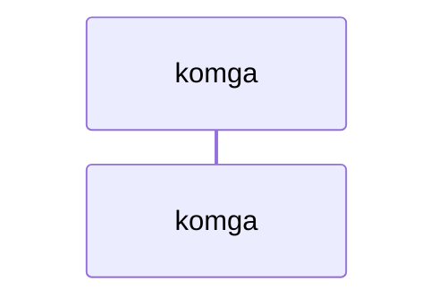
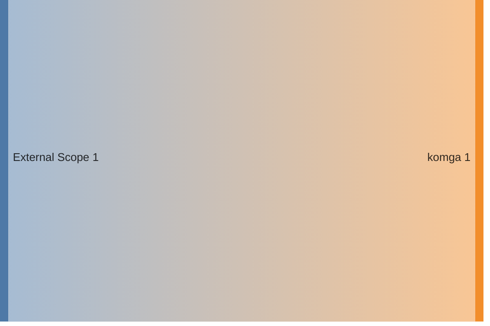

<!-- DOCKUMENTOR START -->
# Architecture

---

## Service Topology


---

## Startup Sequence



---

## Services


### komga

**Image:** `gotson/komga:latest`


| Property | Value |
|----------|-------|
| **Networks** | traefik-public |
| **Depends on** | — |
| **Ports** | External: 25600:25600 |


**Environment:**

```
TZ=${TZ}
KOMGA_ADMIN_EMAIL=${KOMGA_ADMIN_EMAIL}
KOMGA_ADMIN_PASSWORD=${KOMGA_ADMIN_PASSWORD}
KOMGA_OAUTH2ACCOUNTCREATION=true
SPRING_SECURITY_OAUTH2_CLIENT_REGISTRATION_AUTHENTIK_PROVIDER=authentik
SPRING_SECURITY_OAUTH2_CLIENT_REGISTRATION_AUTHENTIK_CLIENT_NAME=Authentik
SPRING_SECURITY_OAUTH2_CLIENT_REGISTRATION_AUTHENTIK_CLIENT_ID=${KOMGA_OAUTH2_CLIENT_ID}
SPRING_SECURITY_OAUTH2_CLIENT_REGISTRATION_AUTHENTIK_CLIENT_SECRET=${KOMGA_OAUTH2_CLIENT_SECRET}
SPRING_SECURITY_OAUTH2_CLIENT_REGISTRATION_AUTHENTIK_SCOPE=openid,email,profile
SPRING_SECURITY_OAUTH2_CLIENT_REGISTRATION_AUTHENTIK_AUTHORIZATION_GRANT_TYPE=authorization_code
SPRING_SECURITY_OAUTH2_CLIENT_PROVIDER_AUTHENTIK_ISSUER_URI=https://auth.${BASE_DOMAIN}/application/o/komga/
SPRING_SECURITY_OAUTH2_CLIENT_PROVIDER_AUTHENTIK_USER_NAME_ATTRIBUTE=preferred_username
```


**Volumes:**

- `komga_config:/config`
- `all_data:/data`


---


## Network Flow


<!-- DOCKUMENTOR END -->
