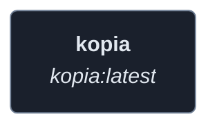
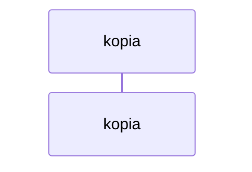
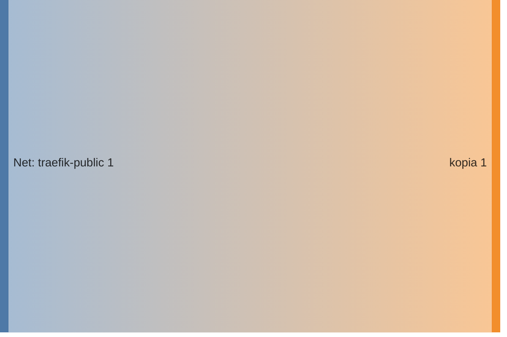

<!-- DOCKUMENTOR START -->
# Architecture

---

## Service Topology



---

## Startup Sequence



---

## Services


### kopia

**Image:** `kopia/kopia:latest`


**Command:** `['server', 'start', '--insecure', '--address=0.0.0.0:51515', '--server-username=${KOPIA_SERVER_USERNAME}', '--server-password=${KOPIA_SERVER_PASSWORD}']`


| Property | Value |
|----------|-------|
| **Networks** | traefik-public |
| **Depends on** | — |


**Environment:**

```
KOPIA_PASSWORD=${KOPIA_PASSWORD}
TZ=${TZ}
```


**Volumes:**

- `kopia_config:/app/config`
- `kopia_cache:/app/cache`
- `app_data:/data/app-data`
- `media_apps:/data/media-apps`


---


## Network Flow


<!-- DOCKUMENTOR END -->
