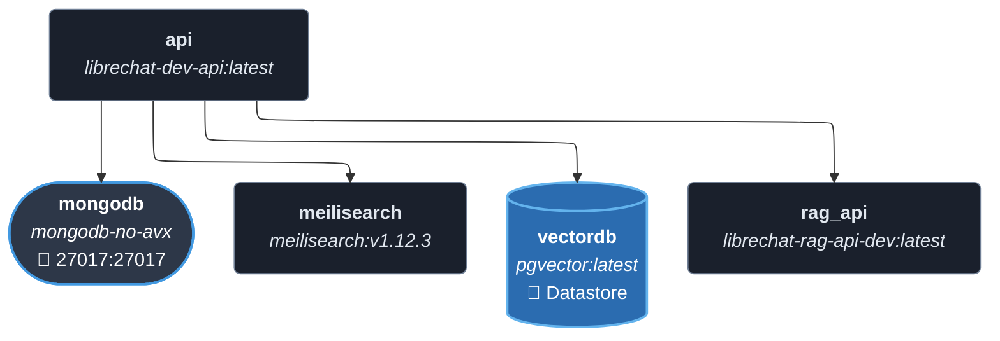
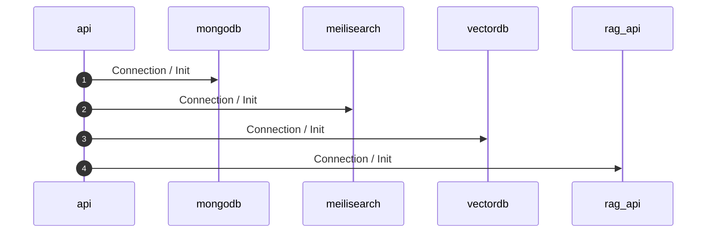
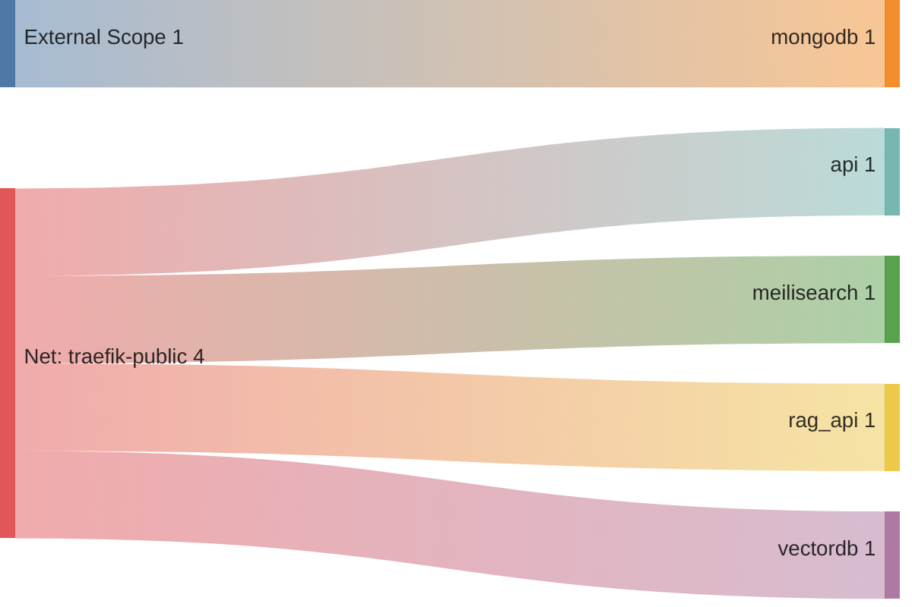

<!-- DOCKUMENTOR START -->
# Architecture

---

## Service Topology



---

## Startup Sequence



---

## Services


### api

**Image:** `ghcr.io/danny-avila/librechat-dev-api:latest`


| Property | Value |
|----------|-------|
| **Networks** | traefik-public |
| **Depends on** | mongodb, meilisearch, vectordb, rag_api |


**Environment:**

```
HOST=0.0.0.0
NODE_ENV=production
MONGO_URI=mongodb://mongodb:27017/LibreChat
MEILI_HOST=http://meilisearch:7700
RAG_PORT=${RAG_PORT:-8000}
RAG_API_URL=http://rag_api:${RAG_PORT:-8000}
```


**Volumes:**

- `librechat_images:/app/client/public/images`
- `librechat_uploads:/app/uploads`
- `librechat_logs:/app/api/logs`


---

### mongodb

**Image:** `nertworkweb/mongodb-no-avx`


**Command:** `--noauth --bind_ip_all`


| Property | Value |
|----------|-------|
| **Networks** | traefik-public |
| **Depends on** | — |
| **Ports** | External: 27017:27017 |


**Volumes:**

- `librechat_mongodb:/data/db`


---

### meilisearch

**Image:** `getmeili/meilisearch:v1.12.3`


| Property | Value |
|----------|-------|
| **Networks** | traefik-public |
| **Depends on** | — |


**Environment:**

```
MEILI_NO_ANALYTICS=true
```


**Volumes:**

- `librechat_meilisearch:/meili_data`


---

### vectordb

**Image:** `ankane/pgvector:latest`


| Property | Value |
|----------|-------|
| **Networks** | traefik-public |
| **Depends on** | — |


**Environment:**

```
POSTGRES_DB=mydatabase
POSTGRES_USER=myuser
POSTGRES_PASSWORD=${POSTGRES_PASSWORD}
PGDATA=/var/lib/postgresql/data/pgdata
```


**Volumes:**

- `librechat_vectordb:/var/lib/postgresql/data`


---

### rag_api

**Image:** `ghcr.io/danny-avila/librechat-rag-api-dev:latest`


| Property | Value |
|----------|-------|
| **Networks** | traefik-public |
| **Depends on** | — |


**Environment:**

```
DB_HOST=vectordb
RAG_PORT=${RAG_PORT:-8000}
RAG_API_URL=http://host.docker.internal:8000
EMBEDDINGS_PROVIDER=ollama
OLLAMA_BASE_URL=http://host.docker.internal:11434
EMBEDDINGS_MODEL=nomic-embed-text
POSTGRES_DB=mydatabase
POSTGRES_USER=myuser
POSTGRES_PASSWORD=${POSTGRES_PASSWORD}
```


---


## Network Flow


<!-- DOCKUMENTOR END -->
