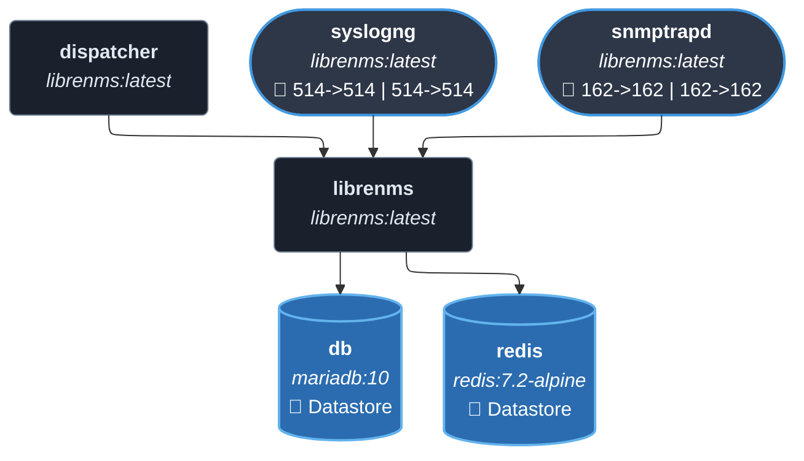
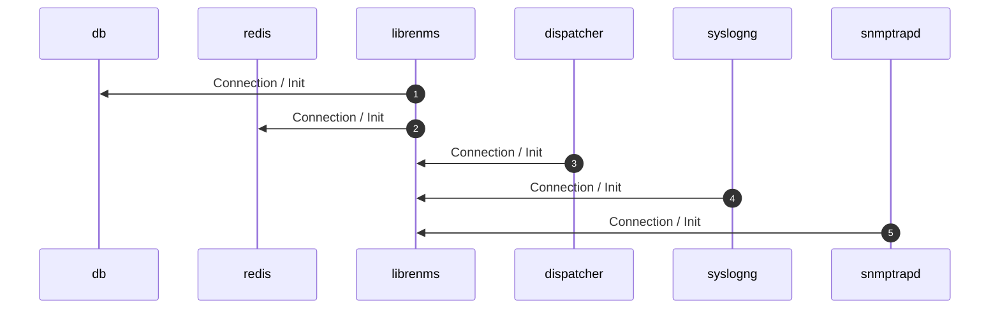
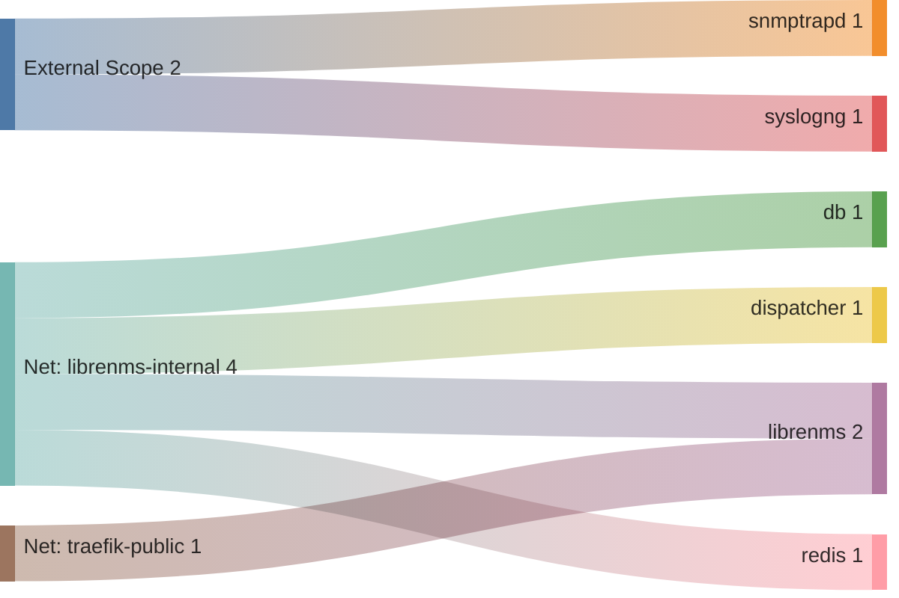

<!-- DOCKUMENTOR START -->
# Architecture

---

## Service Topology



---

## Startup Sequence



---

## Services


### db

**Image:** `mariadb:10`


**Command:** `['mysqld', '--innodb-file-per-table=1', '--lower-case-table-names=0', '--character-set-server=utf8mb4', '--collation-server=utf8mb4_unicode_ci']`


| Property | Value |
|----------|-------|
| **Networks** | librenms-internal |
| **Depends on** | — |


**Environment:**

```
TZ=${TZ:-UTC}
MYSQL_DATABASE=librenms
MYSQL_USER=librenms
MYSQL_PASSWORD=${LIBRENMS_DB_PASSWORD}
MYSQL_ROOT_PASSWORD=${LIBRENMS_DB_PASSWORD}
```


**Volumes:**

- `db:/var/lib/mysql`


---

### redis

**Image:** `redis:7.2-alpine`


**Command:** `--save 60 1 --loglevel warning`


| Property | Value |
|----------|-------|
| **Networks** | librenms-internal |
| **Depends on** | — |


**Volumes:**

- `redis:/data`


---

### librenms

**Image:** `librenms/librenms:latest`


| Property | Value |
|----------|-------|
| **Networks** | librenms-internal, traefik-public |
| **Depends on** | db, redis |


**Environment:**

```
TZ=${TZ:-UTC}
PUID=${PUID:-1000}
PGID=${PGID:-1000}
DB_HOST=db
DB_NAME=librenms
DB_USER=librenms
DB_PASSWORD=${LIBRENMS_DB_PASSWORD}
DB_TIMEOUT=60
REDIS_HOST=redis
REDIS_PORT=6379
REDIS_DB=0
BASE_URL=https://librenms.${BASE_DOMAIN}
LIBRENMS_SNMP_COMMUNITY=${LIBRENMS_SNMP_COMMUNITY:-public}
LIBRENMS_ADMIN_USER=${LIBRENMS_ADMIN_USER:-admin}
LIBRENMS_ADMIN_PASS=${LIBRENMS_ADMIN_PASS}
LIBRENMS_ADMIN_EMAIL=${LIBRENMS_ADMIN_EMAIL}
```


**Volumes:**

- `librenms-data:/data`


---

### dispatcher

**Image:** `librenms/librenms:latest`


| Property | Value |
|----------|-------|
| **Networks** | librenms-internal |
| **Depends on** | librenms |


**Environment:**

```
TZ=${TZ:-UTC}
PUID=${PUID:-1000}
PGID=${PGID:-1000}
DB_HOST=db
DB_NAME=librenms
DB_USER=librenms
DB_PASSWORD=${LIBRENMS_DB_PASSWORD}
DB_TIMEOUT=60
REDIS_HOST=redis
REDIS_PORT=6379
REDIS_DB=0
BASE_URL=https://librenms.${BASE_DOMAIN}
LIBRENMS_SNMP_COMMUNITY=${LIBRENMS_SNMP_COMMUNITY:-public}
SIDECAR_DISPATCHER=1
DISPATCHER_NODE_ID=dispatcher1
```


**Volumes:**

- `librenms-data:/data`


---

### syslogng

**Image:** `librenms/librenms:latest`


| Property | Value |
|----------|-------|
| **Networks** | librenms-internal |
| **Depends on** | librenms |
| **Ports** | External: 514->514 External: 514->514 |


**Environment:**

```
TZ=${TZ:-UTC}
PUID=${PUID:-1000}
PGID=${PGID:-1000}
DB_HOST=db
DB_NAME=librenms
DB_USER=librenms
DB_PASSWORD=${LIBRENMS_DB_PASSWORD}
DB_TIMEOUT=60
REDIS_HOST=redis
REDIS_PORT=6379
REDIS_DB=0
BASE_URL=https://librenms.${BASE_DOMAIN}
SIDECAR_SYSLOGNG=1
```


**Volumes:**

- `librenms-data:/data`


---

### snmptrapd

**Image:** `librenms/librenms:latest`


| Property | Value |
|----------|-------|
| **Networks** | librenms-internal |
| **Depends on** | librenms |
| **Ports** | External: 162->162 External: 162->162 |


**Environment:**

```
TZ=${TZ:-UTC}
PUID=${PUID:-1000}
PGID=${PGID:-1000}
DB_HOST=db
DB_NAME=librenms
DB_USER=librenms
DB_PASSWORD=${LIBRENMS_DB_PASSWORD}
DB_TIMEOUT=60
REDIS_HOST=redis
REDIS_PORT=6379
REDIS_DB=0
BASE_URL=https://librenms.${BASE_DOMAIN}
SIDECAR_SNMPTRAPD=1
```


**Volumes:**

- `librenms-data:/data`


---


## Network Flow


<!-- DOCKUMENTOR END -->
