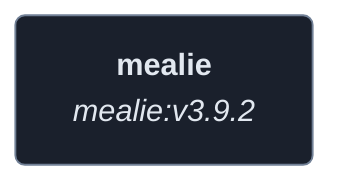
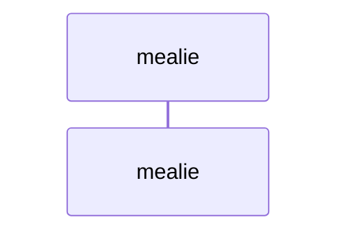
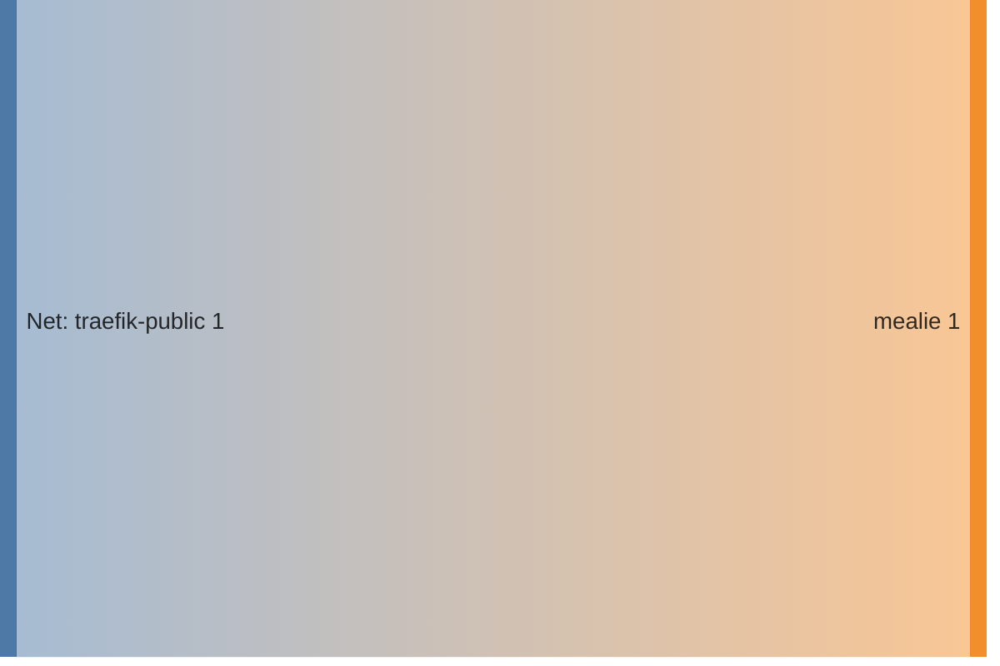

<!-- DOCKUMENTOR START -->
# Architecture

---

## Service Topology



---

## Startup Sequence



---

## Services


### mealie

**Image:** `ghcr.io/mealie-recipes/mealie:v3.9.2`


| Property | Value |
|----------|-------|
| **Networks** | traefik-public |
| **Depends on** | — |


**Environment:**

```
ALLOW_SIGNUP=false
PUID=1000
PGID=1000
TZ=${TZ}
BASE_URL=https://mealie.${BASE_DOMAIN}
MAX_WORKERS=1
WEB_CONCURRENCY=1
AUTO_BACKUP_ENABLED=true
OIDC_AUTH_ENABLED=true
OIDC_SIGNUP_ENABLED=true
OIDC_CONFIGURATION_URL=https://auth.${BASE_DOMAIN}/application/o/mealie/.well-known/openid-configuration
OIDC_CLIENT_ID=${MEALIE_OAUTH_CLIENT_ID}
OIDC_CLIENT_SECRET=${MEALIE_OAUTH_CLIENT_SECRET}
OIDC_PROVIDER_NAME=Authentik
OIDC_AUTO_REDIRECT=false
OIDC_ADMIN_GROUP=Mealie Admins
OIDC_USER_GROUP=Mealie Users
```


**Volumes:**

- `mealie_data:/app/data`


---


## Network Flow


<!-- DOCKUMENTOR END -->
