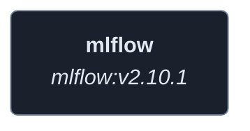
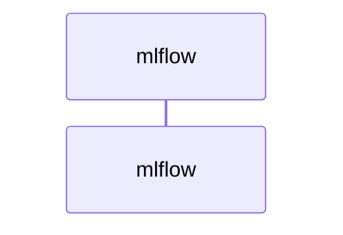
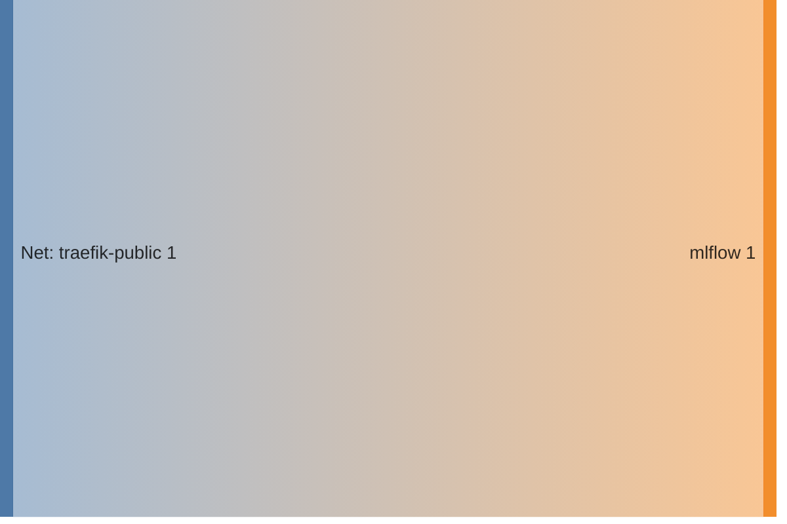

<!-- DOCKUMENTOR START -->
# Architecture

---

## Service Topology



---

## Startup Sequence



---

## Services


### mlflow

**Image:** `ghcr.io/mlflow/mlflow:v2.10.1`


**Command:** `mlflow server --host 0.0.0.0 --port 5000 --backend-store-uri file:///mlflow/backend --default-artifact-root file:///mlflow/artifacts
`


| Property | Value |
|----------|-------|
| **Networks** | traefik-public |
| **Depends on** | — |


**Environment:**

```
TZ=${TZ}
```


**Volumes:**

- `mlflow_data:/mlflow`


---


## Network Flow


<!-- DOCKUMENTOR END -->
