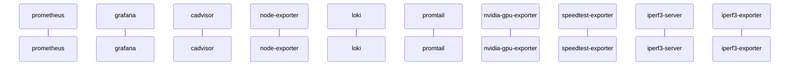
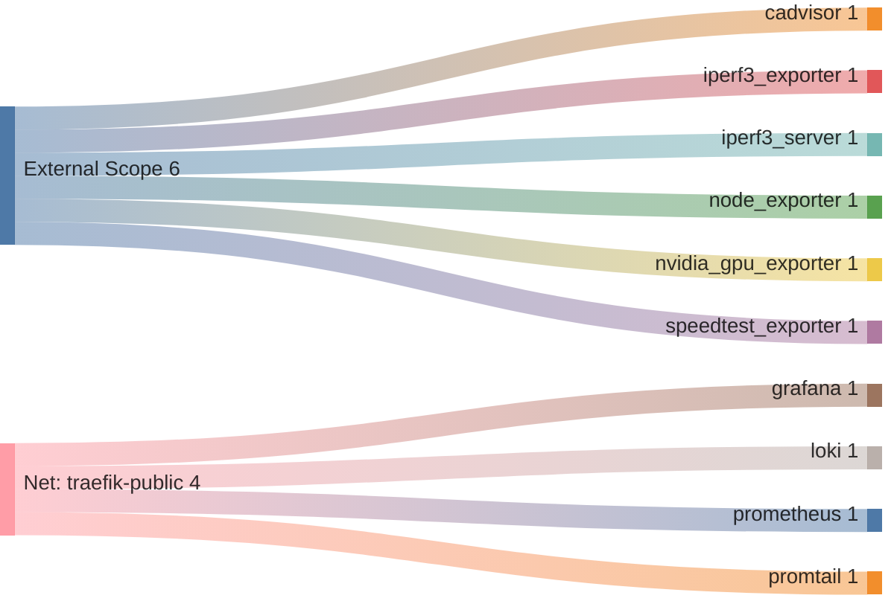

<!-- DOCKUMENTOR START -->
# Architecture

---

## Service Topology


---

## Startup Sequence



---

## Services


### prometheus

**Image:** `prom/prometheus:v2.55.0`


| Property | Value |
|----------|-------|
| **Networks** | traefik-public |
| **Depends on** | — |


**Volumes:**

- `prometheus_data:/prometheus`
- `./prometheus.yml:/etc/prometheus/prometheus.yml:ro`
- `/var/run/docker.sock:/var/run/docker.sock:ro`


---

### grafana

**Image:** `grafana/grafana:11.1.4`


| Property | Value |
|----------|-------|
| **Networks** | traefik-public |
| **Depends on** | — |


**Environment:**

```
GF_SECURITY_ADMIN_USER=admin
GF_SECURITY_ADMIN_PASSWORD=${GRAFANA_ADMIN_PASSWORD}
GF_AUTH_GENERIC_OAUTH_ENABLED=true
GF_AUTH_GENERIC_OAUTH_NAME=Authentik
GF_AUTH_GENERIC_OAUTH_CLIENT_ID=${GRAFANA_OAUTH_CLIENT_ID}
GF_AUTH_GENERIC_OAUTH_CLIENT_SECRET=${GRAFANA_OAUTH_CLIENT_SECRET}
GF_AUTH_GENERIC_OAUTH_SCOPES=openid profile email
GF_AUTH_GENERIC_OAUTH_AUTH_URL=https://auth.${BASE_DOMAIN}/application/o/authorize/
GF_AUTH_GENERIC_OAUTH_TOKEN_URL=https://auth.${BASE_DOMAIN}/application/o/token/
GF_AUTH_GENERIC_OAUTH_API_URL=https://auth.${BASE_DOMAIN}/application/o/userinfo/
GF_AUTH_GENERIC_OAUTH_ROLE_ATTRIBUTE_PATH=contains(groups, 'Grafana Admins') && 'Admin' || contains(groups, 'Grafana Editors') && 'Editor' || 'Viewer'
GF_AUTH_SIGNOUT_REDIRECT_URL=https://auth.${BASE_DOMAIN}/application/o/grafana/end-session/
GF_SERVER_ROOT_URL=https://grafana.${BASE_DOMAIN}
```


**Volumes:**

- `grafana_data:/var/lib/grafana`
- `grafana_dashboards:/etc/grafana/provisioning/dashboards`
- `./dashboards/dashboards.yml:/etc/grafana/provisioning/dashboards/dashboards.yml:ro`
- `./dashboards/local:/etc/grafana/provisioning/dashboards-local:ro`


---

### cadvisor

**Image:** `gcr.io/cadvisor/cadvisor:v0.49.1`


**Command:** `['--docker_only=true', '--housekeeping_interval=30s']`


| Property | Value |
|----------|-------|
| **Networks** | traefik-public |
| **Depends on** | — |
| **Ports** | External: 8080->8080 |


**Volumes:**

- `/:/rootfs:ro`
- `/var/run:/var/run:ro`
- `/sys:/sys:ro`
- `/var/lib/docker/:/var/lib/docker:ro`
- `/dev/disk/:/dev/disk:ro`


---

### node-exporter

**Image:** `prom/node-exporter:v1.8.2`


**Command:** `['--path.procfs=/host/proc', '--path.sysfs=/host/sys', '--path.rootfs=/rootfs', '--collector.filesystem.mount-points-exclude=^/(sys|proc|dev|host|etc)($$$$|/)']`


| Property | Value |
|----------|-------|
| **Networks** | traefik-public |
| **Depends on** | — |
| **Ports** | External: 9100->9100 |


**Volumes:**

- `/proc:/host/proc:ro`
- `/sys:/host/sys:ro`
- `/:/rootfs:ro`


---

### loki

**Image:** `grafana/loki:3.0.0`


**Command:** `-config.file=/etc/loki/config.yml`


| Property | Value |
|----------|-------|
| **Networks** | traefik-public |
| **Depends on** | — |


**Volumes:**

- `loki_data:/loki`


---

### promtail

**Image:** `grafana/promtail:3.0.0`


**Command:** `-config.file=/etc/promtail/config.yml`


| Property | Value |
|----------|-------|
| **Networks** | traefik-public |
| **Depends on** | — |


**Volumes:**

- `/var/lib/docker/containers:/var/lib/docker/containers:ro`
- `/var/run/docker.sock:/var/run/docker.sock:ro`
- `/var/log/journal:/var/log/journal:ro`
- `/run/log/journal:/run/log/journal:ro`
- `/etc/machine-id:/etc/machine-id:ro`
- `promtail_positions:/run/promtail`


---

### nvidia-gpu-exporter

**Image:** `nvcr.io/nvidia/k8s/dcgm-exporter:3.3.8-3.6.0-ubuntu22.04`


| Property | Value |
|----------|-------|
| **Networks** | traefik-public |
| **Depends on** | — |
| **Ports** | External: 9400->9400 |


**Environment:**

```
NVIDIA_VISIBLE_DEVICES=all
```


---

### speedtest-exporter

**Image:** `miguelndecarvalho/speedtest-exporter:latest`


| Property | Value |
|----------|-------|
| **Networks** | traefik-public |
| **Depends on** | — |
| **Ports** | External: 9798->9798 |


**Environment:**

```
SPEEDTEST_INTERVAL=1800
```


---

### iperf3-server

**Image:** `${MONITORING_REGISTRY_URL:-ghcr.io}/${MONITORING_REGISTRY_NAMESPACE:-your-username}/iperf3-server:${MONITORING_IMAGE_TAG:-latest}`


| Property | Value |
|----------|-------|
| **Networks** | traefik-public |
| **Depends on** | — |
| **Ports** | External: 5201->5201 |


---

### iperf3-exporter

**Image:** `${MONITORING_REGISTRY_URL:-ghcr.io}/${MONITORING_REGISTRY_NAMESPACE:-your-username}/iperf3-exporter:${MONITORING_IMAGE_TAG:-latest}`


| Property | Value |
|----------|-------|
| **Networks** | default |
| **Depends on** | — |
| **Ports** | External: 9579->9579 |


---


## Network Flow


<!-- DOCKUMENTOR END -->
