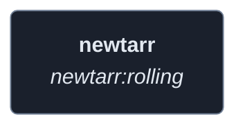
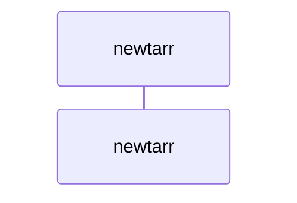
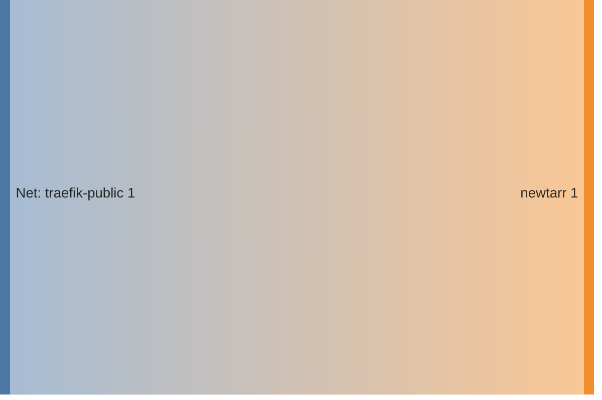

<!-- DOCKUMENTOR START -->
# Architecture

---

## Service Topology



---

## Startup Sequence



---

## Services


### newtarr

**Image:** `ghcr.io/elfhosted/newtarr:rolling`


| Property | Value |
|----------|-------|
| **Networks** | traefik-public |
| **Depends on** | — |


**Environment:**

```
PUID=1000
PGID=1000
TZ=${TZ}
```


**Volumes:**

- `newtarr_config:/config`


---


## Network Flow


<!-- DOCKUMENTOR END -->
