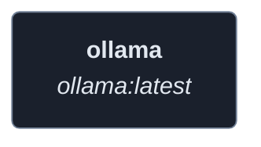
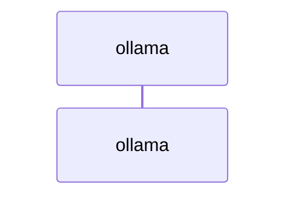
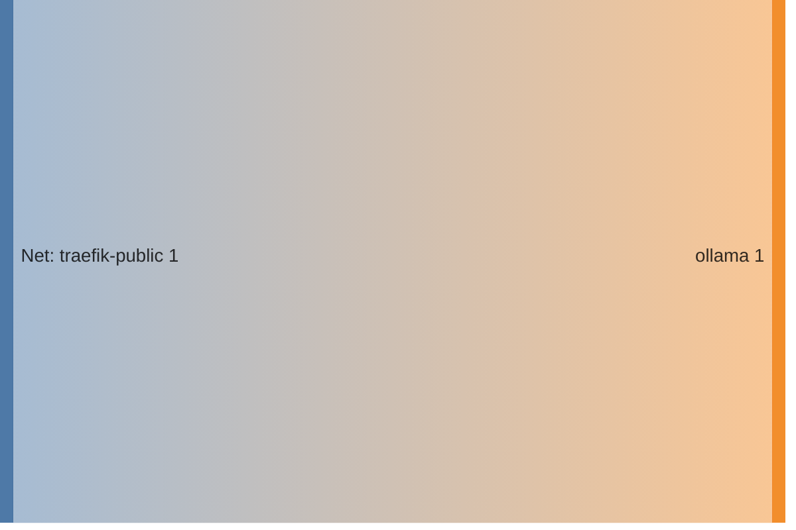

<!-- DOCKUMENTOR START -->
# Architecture

---

## Service Topology



---

## Startup Sequence



---

## Services


### ollama

**Image:** `ollama/ollama:latest`


| Property | Value |
|----------|-------|
| **Networks** | traefik-public |
| **Depends on** | — |


**Environment:**

```
OLLAMA_HOST=0.0.0.0
OLLAMA_ORIGINS=*
OLLAMA_DEBUG=1
NVIDIA_VISIBLE_DEVICES=all
NVIDIA_DRIVER_CAPABILITIES=compute,utility
```


**Volumes:**

- `ollama-data:/root/.ollama`


---


## Network Flow


<!-- DOCKUMENTOR END -->
