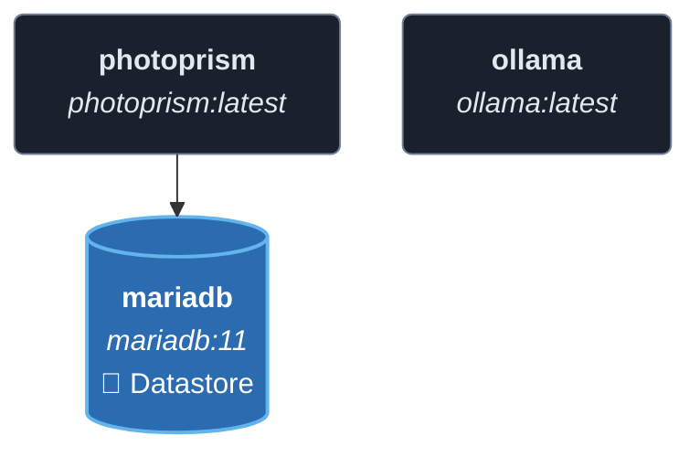
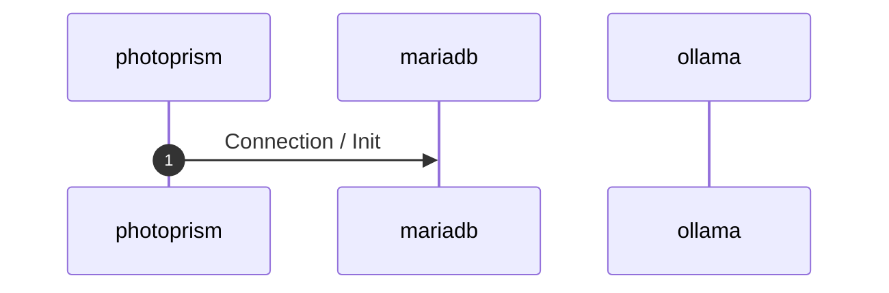
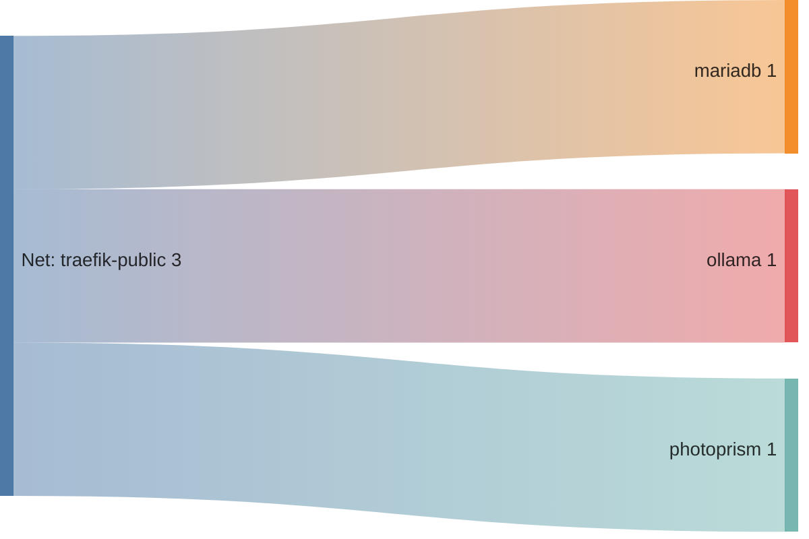

<!-- DOCKUMENTOR START -->
# Architecture

---

## Service Topology



---

## Startup Sequence



---

## Services


### photoprism

**Image:** `photoprism/photoprism:latest`


| Property | Value |
|----------|-------|
| **Networks** | traefik-public |
| **Depends on** | mariadb |


**Environment:**

```
PHOTOPRISM_ADMIN_USER=admin
PHOTOPRISM_ADMIN_PASSWORD=${PHOTOPRISM_ADMIN_PASSWORD}
PHOTOPRISM_AUTH_MODE=password
PHOTOPRISM_SITE_URL=https://photo.${BASE_DOMAIN}/
PHOTOPRISM_DISABLE_TLS=true
PHOTOPRISM_DEFAULT_TLS=true
PHOTOPRISM_ORIGINALS_LIMIT=5000
PHOTOPRISM_HTTP_COMPRESSION=gzip
PHOTOPRISM_LOG_LEVEL=info
PHOTOPRISM_READONLY=false
PHOTOPRISM_EXPERIMENTAL=true
PHOTOPRISM_DISABLE_CHOWN=false
PHOTOPRISM_DISABLE_WEBDAV=false
PHOTOPRISM_DISABLE_SETTINGS=false
PHOTOPRISM_DISABLE_TENSORFLOW=false
PHOTOPRISM_DISABLE_FACES=false
PHOTOPRISM_DISABLE_CLASSIFICATION=false
PHOTOPRISM_DISABLE_VECTORS=false
PHOTOPRISM_DISABLE_RAW=false
PHOTOPRISM_RAW_PRESETS=false
PHOTOPRISM_JPEG_QUALITY=85
PHOTOPRISM_DETECT_NSFW=true
PHOTOPRISM_UPLOAD_NSFW=true
PHOTOPRISM_DATABASE_DRIVER=mysql
PHOTOPRISM_DATABASE_SERVER=mariadb:3306
PHOTOPRISM_DATABASE_NAME=photoprism
PHOTOPRISM_DATABASE_USER=photoprism
PHOTOPRISM_DATABASE_PASSWORD=${PHOTOPRISM_DB_PASSWORD}
PHOTOPRISM_SITE_CAPTION=AI-Powered Photos App
PHOTOPRISM_SITE_DESCRIPTION=
PHOTOPRISM_SITE_AUTHOR=
PHOTOPRISM_FFMPEG_ENCODER=nvidia
NVIDIA_VISIBLE_DEVICES=all
NVIDIA_DRIVER_CAPABILITIES=all
PHOTOPRISM_INIT=tensorflow-gpu
```


**Volumes:**

- `all_data:/photoprism/originals`
- `photoprism_storage:/photoprism/storage`


---

### mariadb

**Image:** `mariadb:11`


**Command:** `--innodb-buffer-pool-size=512M --transaction-isolation=READ-COMMITTED --character-set-server=utf8mb4 --collation-server=utf8mb4_unicode_ci --max-connections=512 --innodb-rollback-on-timeout=OFF --innodb-lock-wait-timeout=120`


| Property | Value |
|----------|-------|
| **Networks** | traefik-public |
| **Depends on** | — |


**Environment:**

```
MARIADB_AUTO_UPGRADE=1
MARIADB_INITDB_SKIP_TZINFO=1
MARIADB_DATABASE=photoprism
MARIADB_USER=photoprism
MARIADB_PASSWORD=${PHOTOPRISM_DB_PASSWORD}
MARIADB_ROOT_PASSWORD=${MARIADB_ROOT_PASSWORD}
```


**Volumes:**

- `photoprism_database:/var/lib/mysql`


---

### ollama

**Image:** `ollama/ollama:latest`


| Property | Value |
|----------|-------|
| **Networks** | traefik-public |
| **Depends on** | — |


**Environment:**

```
OLLAMA_HOST=0.0.0.0:11434
OLLAMA_MODELS=/root/.ollama
OLLAMA_MAX_QUEUE=100
OLLAMA_NUM_PARALLEL=1
OLLAMA_MAX_LOADED_MODELS=1
OLLAMA_LOAD_TIMEOUT=5m
OLLAMA_KEEP_ALIVE=5m
OLLAMA_CONTEXT_LENGTH=4096
OLLAMA_MULTIUSER_CACHE=false
OLLAMA_NOPRUNE=false
OLLAMA_NOHISTORY=true
OLLAMA_FLASH_ATTENTION=false
OLLAMA_KV_CACHE_TYPE=f16
OLLAMA_SCHED_SPREAD=false
OLLAMA_NEW_ENGINE=true
NVIDIA_VISIBLE_DEVICES=all
NVIDIA_DRIVER_CAPABILITIES=compute,utility
```


**Volumes:**

- `photoprism_ollama:/root/.ollama`


---


## Network Flow


<!-- DOCKUMENTOR END -->
