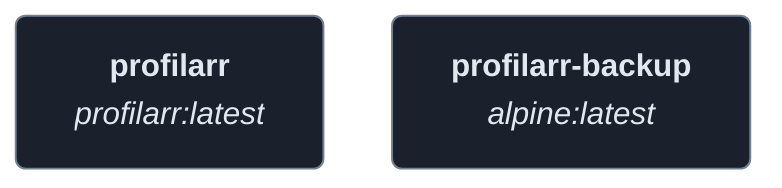
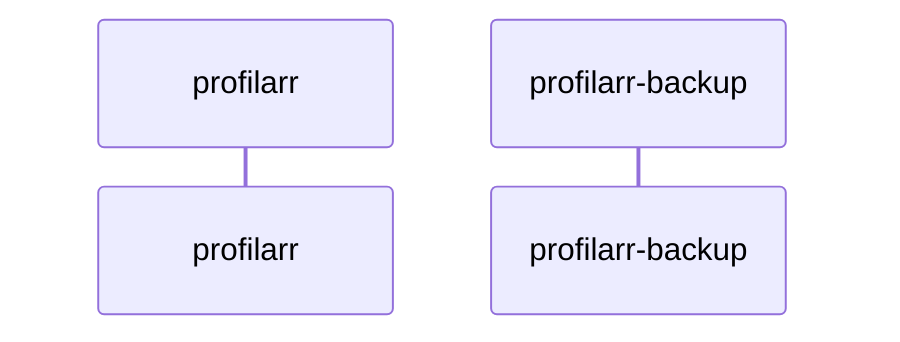
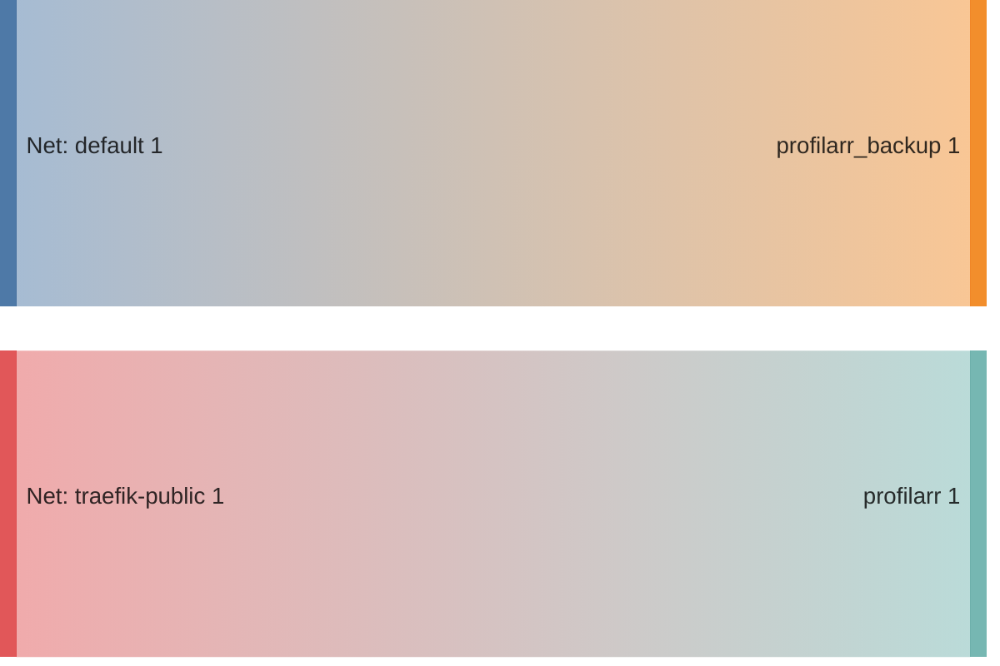

<!-- DOCKUMENTOR START -->
# Architecture

---

## Service Topology



---

## Startup Sequence



---

## Services


### profilarr

**Image:** `santiagosayshey/profilarr:latest`


| Property | Value |
|----------|-------|
| **Networks** | traefik-public |
| **Depends on** | — |


**Environment:**

```
PUID=1000
PGID=1000
TZ=${TZ}
```


**Volumes:**

- `profilarr_config:/config`


---

### profilarr-backup

**Image:** `alpine:latest`


**Command:** `['/bin/sh', '/backup.sh']`


| Property | Value |
|----------|-------|
| **Networks** | default |
| **Depends on** | — |


**Environment:**

```
TZ=${TZ}
```


**Volumes:**

- `profilarr_config:/source:ro`
- `profilarr_nas_backup:/dest`
- `./backup.sh:/backup.sh:ro`


---


## Network Flow


<!-- DOCKUMENTOR END -->
