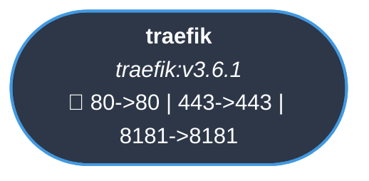
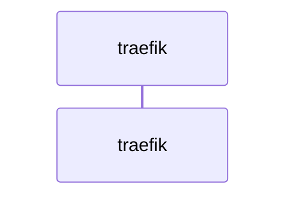
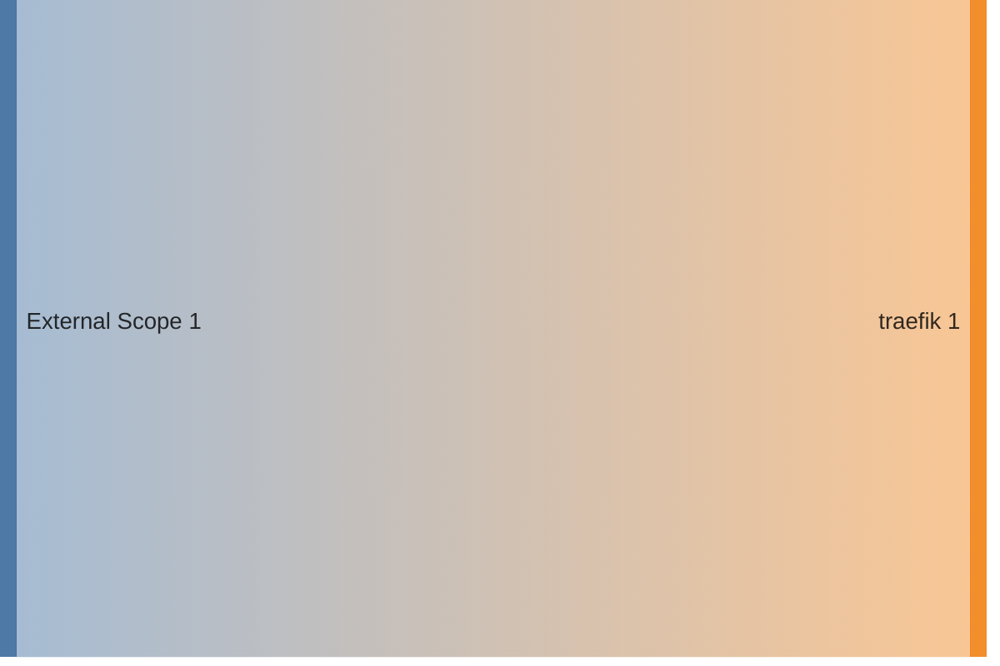

<!-- DOCKUMENTOR START -->
# Architecture

---

## Service Topology



---

## Startup Sequence



---

## Services


### traefik

**Image:** `traefik:v3.6.1`


**Command:** `['--log.level=DEBUG', '--accesslog=true', '--accesslog.format=json', '--accesslog.bufferingsize=100', '--providers.swarm.endpoint=unix:///var/run/docker.sock', '--providers.swarm.exposedbydefault=false', '--providers.swarm.refreshSeconds=15', '--entrypoints.web.address=:80', '--entrypoints.web.http.redirections.entryPoint.to=websecure', '--entrypoints.web.http.redirections.entryPoint.scheme=https', '--entrypoints.websecure.address=:443', '--entrypoints.metrics.address=:9100', '--entrypoints.hubitat.address=:8181', '--certificatesresolvers.dns.acme.caServer=https://acme-v02.api.letsencrypt.org/directory', '--certificatesresolvers.dns.acme.storage=/letsencrypt/acme.json', '--certificatesresolvers.dns.acme.dnschallenge.provider=cloudflare', '--certificatesresolvers.dns.acme.dnschallenge.resolvers=${ACME_DNS_RESOLVERS}', '--certificatesresolvers.dns.acme.dnschallenge.propagation.delayBeforeChecks=120', '--metrics.prometheus=true', '--metrics.prometheus.addEntryPointsLabels=true', '--metrics.prometheus.addServicesLabels=true', '--metrics.prometheus.entryPoint=metrics', '--serversTransport.insecureSkipVerify=true', '--api.dashboard=true', '--ping=true']`


| Property | Value |
|----------|-------|
| **Networks** | traefik-public |
| **Depends on** | — |
| **Ports** | External: 80->80 External: 443->443 External: 8181->8181 |


**Environment:**

```
CF_DNS_API_TOKEN=${CLOUDFLARE_DNS_API_TOKEN}
```


**Volumes:**

- `/var/run/docker.sock:/var/run/docker.sock:ro`
- `ssl_certs:/letsencrypt`


---


## Network Flow


<!-- DOCKUMENTOR END -->
