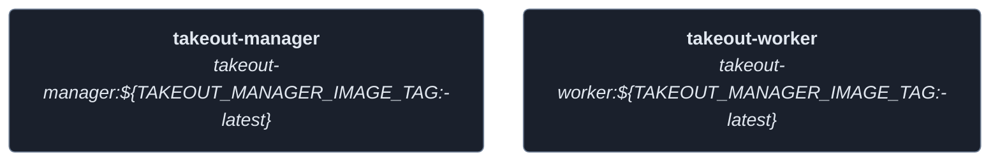
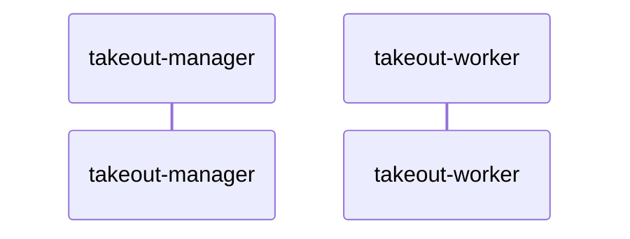
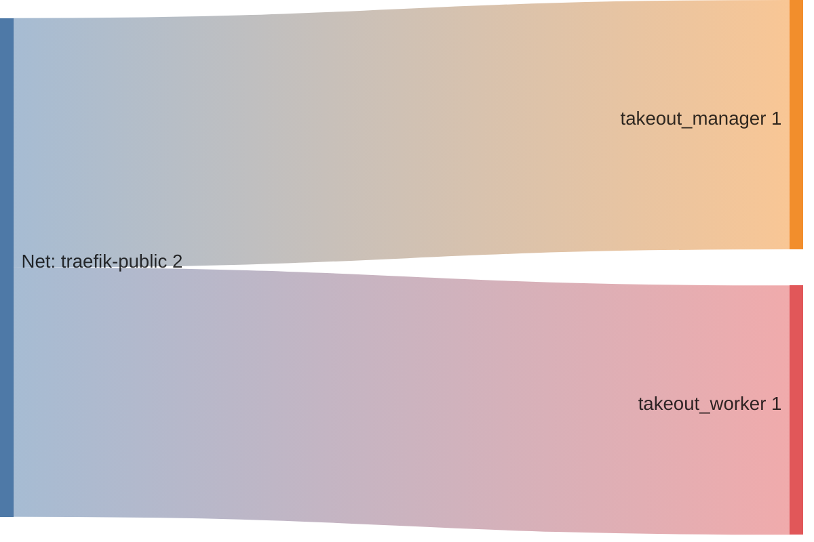

<!-- DOCKUMENTOR START -->
# Architecture

---

## Service Topology



---

## Startup Sequence



---

## Services


### takeout-manager

**Image:** `${TAKEOUT_MANAGER_REGISTRY_URL:-ghcr.io}/${TAKEOUT_MANAGER_REGISTRY_NAMESPACE:-your-username}/takeout-manager:${TAKEOUT_MANAGER_IMAGE_TAG:-latest}`


| Property | Value |
|----------|-------|
| **Networks** | traefik-public |
| **Depends on** | — |


**Environment:**

```
TZ=${TZ:-UTC}
PUID=${PUID:-1000}
PGID=${PGID:-1000}
```


**Volumes:**

- `takeout-manager-db:/app/db`


---

### takeout-worker

**Image:** `${TAKEOUT_MANAGER_REGISTRY_URL:-ghcr.io}/${TAKEOUT_MANAGER_REGISTRY_NAMESPACE:-your-username}/takeout-worker:${TAKEOUT_MANAGER_IMAGE_TAG:-latest}`


| Property | Value |
|----------|-------|
| **Networks** | traefik-public |
| **Depends on** | — |


**Environment:**

```
TZ=${TZ:-UTC}
PUID=${PUID:-1000}
PGID=${PGID:-1000}
MANAGER_URL=http://takeout-manager:8000
```


**Volumes:**

- `takeout-downloads:/downloads`
- `takeout-pictures:/pictures`
- `takeout-videos:/videos`


---


## Network Flow


<!-- DOCKUMENTOR END -->
