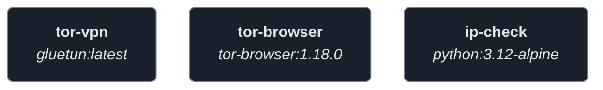
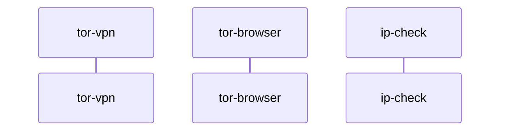
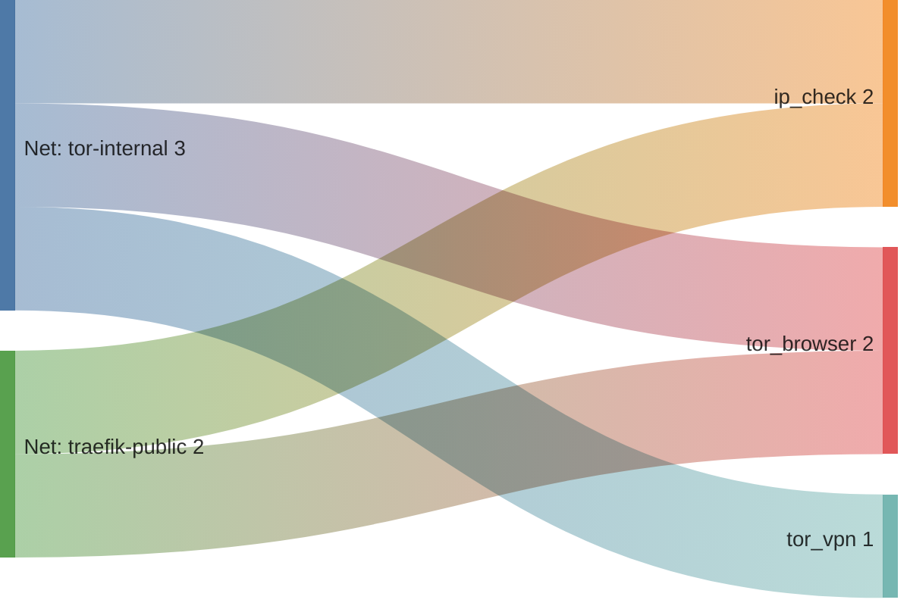

<!-- DOCKUMENTOR START -->
# Architecture

---

## Service Topology



---

## Startup Sequence



---

## Services


### tor-vpn

**Image:** `qmcgaw/gluetun:latest`


| Property | Value |
|----------|-------|
| **Networks** | tor-internal |
| **Depends on** | — |


**Environment:**

```
VPN_SERVICE_PROVIDER=${TOR_VPN_SERVICE_PROVIDER}
VPN_TYPE=wireguard
WIREGUARD_PRIVATE_KEY=${TOR_WIREGUARD_PRIVATE_KEY}
WIREGUARD_ADDRESSES=${TOR_WIREGUARD_ADDRESSES}
SERVER_COUNTRIES=${TOR_VPN_SERVER_COUNTRIES}
TZ=${TZ}
SOCKS5_ENABLED=on
SOCKS5_LISTENING_ADDRESS=:1080
FIREWALL_INPUT_PORTS=1080
```


---

### tor-browser

**Image:** `kasmweb/tor-browser:1.18.0`


| Property | Value |
|----------|-------|
| **Networks** | tor-internal, traefik-public |
| **Depends on** | — |


**Environment:**

```
VNC_PW=${TOR_BROWSER_VNC_PASSWORD}
TZ=${TZ}
DISABLE_CUSTOM_STARTUP=true
```


**Volumes:**

- `tor_browser_data:/home/kasm-user`
- `{'type': 'tmpfs', 'target': '/dev/shm', 'tmpfs': {'size': 536870912}}`


---

### ip-check

**Image:** `python:3.12-alpine`


**Command:** `['python3', '/app/server.py']`


| Property | Value |
|----------|-------|
| **Networks** | tor-internal, traefik-public |
| **Depends on** | — |


**Environment:**

```
TOR_VPN_HOST=tor-vpn
TOR_VPN_SOCKS_PORT=1080
```


---


## Network Flow


<!-- DOCKUMENTOR END -->
