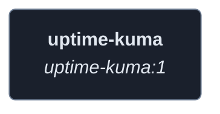
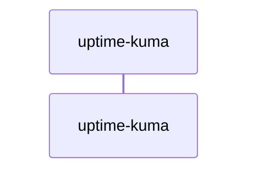
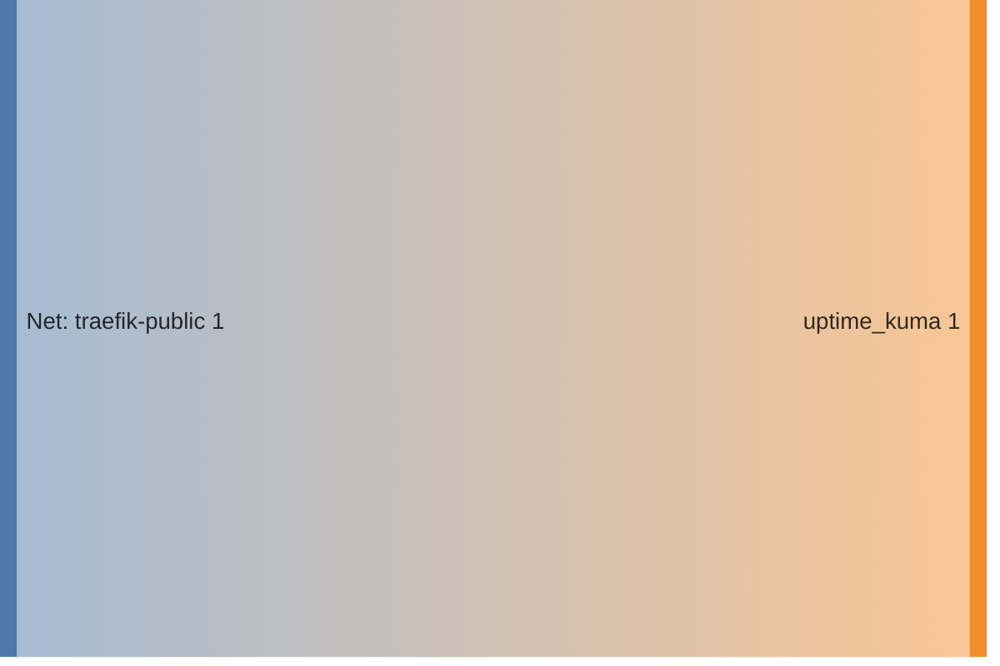

<!-- DOCKUMENTOR START -->
# Architecture

---

## Service Topology

---

## Startup Sequence

---

## Services

### uptime-kuma

**Image:** `louislam/uptime-kuma:1`

| Property | Value |
|----------|-------|
| **Networks** | traefik-public |
| **Depends on** | — |

**Volumes:**

- `uptime-kuma-data:/app/data`

---

## Network Flow

<!-- DOCKUMENTOR END -->
