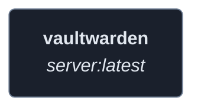
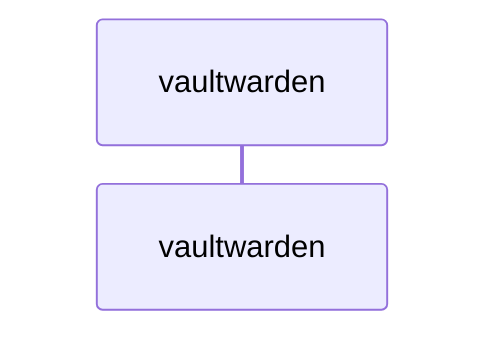
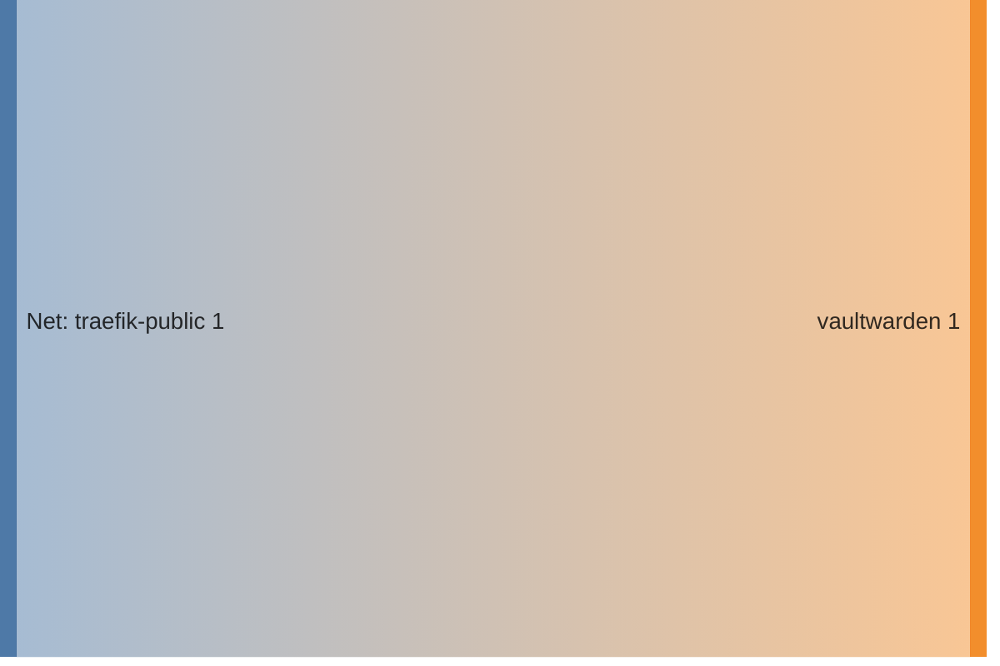

<!-- DOCKUMENTOR START -->
# Architecture

---

## Service Topology



---

## Startup Sequence



---

## Services


### vaultwarden

**Image:** `vaultwarden/server:latest`


| Property | Value |
|----------|-------|
| **Networks** | traefik-public |
| **Depends on** | — |


**Environment:**

```
DOMAIN=https://vaultwarden.${BASE_DOMAIN}
ADMIN_TOKEN=${VAULTWARDEN_ADMIN_TOKEN:-some-random-token-change-me}
SSO_ENABLED=true
SSO_ONLY=false
SSO_AUTHORITY=https://auth.${BASE_DOMAIN}/application/o/vaultwarden/
SSO_CLIENT_ID=${VAULTWARDEN_OAUTH_CLIENT_ID}
SSO_CLIENT_SECRET=${VAULTWARDEN_OAUTH_CLIENT_SECRET}
SSO_SCOPES=openid email profile
```


**Volumes:**

- `vaultwarden-data:/data`


---


## Network Flow


<!-- DOCKUMENTOR END -->
