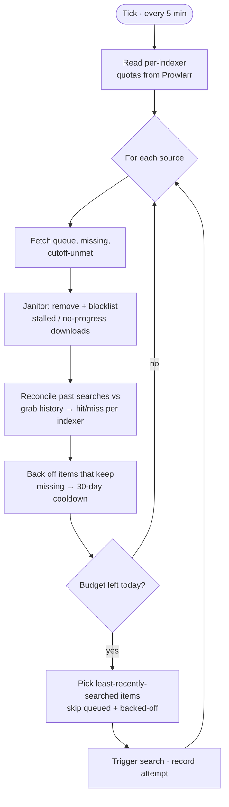

# Warden

Warden hunts for missing movies and episodes in Radarr and Sonarr — and cleans up
the download queue — without tripping your indexers' rate limits. It replaces newtarr.

The problem with naive hunters is that they hammer the search endpoint, get the
indexers banned in Prowlarr, and then find nothing. Warden meters itself against the
*actual* per-indexer daily limits Prowlarr enforces, spreads its searches across the
day, and never re-searches something it already has queued.

## What it does each tick

A tick runs every 5 minutes. For each instance (radarr, sonarr) it does the janitor
work first — which costs no quota — then hunts only if there's budget left.



The janitor runs every tick even when quota is exhausted, so a stuck queue gets
cleaned regardless of how much hunting is left.

## How the budget works

Every search hits *all* of a source's synced indexers, so the binding limit is the
**smallest** per-indexer daily cap among them (read live from Prowlarr, minus a
reserve). Warden tracks what it has spent today and paces the rest evenly until the
daily reset — so it drips searches out instead of burning the budget at midnight.

If Prowlarr is unreachable it falls back to a flat per-day budget.

## The janitor

- **Stalled** — Radarr/Sonarr flag a download `warning` + "stalled with no connections"
  past a grace period → remove and blocklist so it can re-grab a different release.
- **No-progress** — a download whose `sizeleft` hasn't moved past a floor over a window
  → same treatment. Slowly-progressing downloads are left alone.
- A guard bails the whole sweep only when the *download client itself* is unreachable
  (`downloadClientUnavailable` over half the queue), so warden never deletes data
  during an outage.

## Search efficacy & backoff

Warden correlates each search it fires against Radarr/Sonarr grab history: a grab for
that item afterward is a **hit** (attributed to the indexer that delivered it); no grab
within the resolve window is a **miss**. After 3 straight misses an item is assumed
unfindable and parked for 30 days, so scarce quota goes to things that can actually be
found. A grab resets the streak.

## State

SQLite at `/state/warden.db` (survives restarts):

| Table | Holds |
|----------------------|-------------------------------------------|
| `search_ledger`      | searches spent per source per day         |
| `queue_progress`     | no-progress anchors per download          |
| `search_attempt`     | searches awaiting hit/miss reconciliation |
| `search_backoff`     | miss streaks + cooldown expiries          |

## Configuration

All via `WARDEN_*` env vars. Instances are discovered from `WARDEN_RADARR_URL` /
`WARDEN_RADARR_API_KEY` (and the `SONARR` equivalents).

| Var | Default | What |
|-----|---------|------|
| `WARDEN_POLL_INTERVAL_SEC` | `300` | seconds between ticks |
| `WARDEN_RESERVE_PCT` | `20` | quota held back from the indexer limit |
| `WARDEN_RESET_AT_LOCAL` | `00:00` | when the daily budget resets |
| `WARDEN_STALE_GRACE_HOURS` | `48` | age before a stalled item is removable |
| `WARDEN_STALE_NO_PROGRESS_HOURS` | `12` | how long an item must stay completely frozen before removal |
| `WARDEN_STALE_JITTER_TOLERANCE_MB` | `0` | drain below this counts as frozen (`0` = any progress resets the clock) |
| `WARDEN_EFFICACY_RESOLVE_MINUTES` | `30` | how long to wait for a grab before scoring a miss |
| `WARDEN_BACKOFF_MISS_THRESHOLD` | `3` | misses before an item is parked |
| `WARDEN_BACKOFF_COOLDOWN_DAYS` | `30` | how long a parked item stays excluded |

Each feature has an `_ENABLED` toggle (sweep, no-progress, efficacy, backoff).

## Observability

- `/healthz` and `/metrics` on port 9090.
- Prometheus scrapes `warden_*` metrics; the "Warden — *arr Hunter" Grafana dashboard
  shows budget, queue health, search hit-rate per indexer, and backed-off counts.

## Layout

```
warden/
  clients/       Radarr/Sonarr/Prowlarr HTTP
  repositories/  SQLite persistence
  services/      tick logic (pure, testable)
  routes/        health + metrics
  models.py      shared dataclasses
```

Imports flow `routes → services → repositories → clients` (enforced by import-linter).
Unit tests cover the logic; the integration suite (`tests/integration`, marked
`@pytest.mark.integration`) runs the real process against fake *arr HTTP servers —
`task test:integration -- warden`, and in CI as part of each build.
